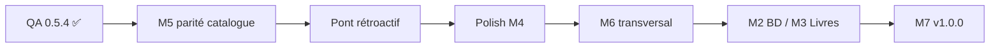
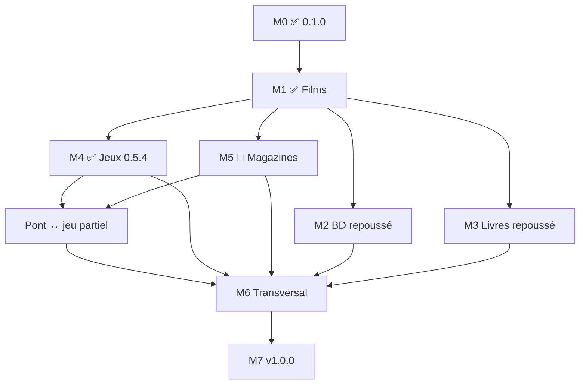

# Roadmap — Médiathèque

**Version actuelle : 0.6.0** (2026-06-16)  
**Documentation :** [doc/mediatheque.md](doc/mediatheque.md) · [CHANGELOG.md](CHANGELOG.md)

---

## Vision

Une **seule application** pour gérer films, BD/manga, livres, jeux vidéo et magazines, avec le **même parcours** (catalogue → collection → envies → notes) et un **changement de contexte global** via des **onglets colorés**.

**Principe :** un champ `media_domain` sur le catalogue (`oeuvres`) filtre données et écrans ; les spécificités de chaque média s’ajoutent par phases sans réécrire toute l’app.

---

## Où en est-on ? (synthèse 0.6.0)

| Domaine | Statut | Versions | Parcours catalogue → collection |
|---------|--------|----------|----------------------------------|
| **Films** | ✅ Production | 0.4.4+ → **0.6.0** | Complet (TMDB, autocomplétion, fiche `/oeuvre.php`, **vue Bibliothèque**) |
| **Jeux** | ✅ Utilisable | 0.5.0 → **0.6.0** | Complet (extensions, remakes, autocomplétion, recherche tolérante, **IGDB**, **sagas**, **vue Bibliothèque**, acronymes) |
| **Magazines** | 🔄 Avancé (~90 %) | 0.2.x → **0.6.0** | Import catalogue ABM, ajout série catalogue, retrait série ; autocomplétion numéro ⏳ |
| **BD / Manga** | ⏸️ Repoussé | — | — |
| **Livres** | ⏸️ Repoussé | — | — |

### Phases (suivi)

| Phase | Statut | Version livrée | Suite |
|-------|--------|----------------|-------|
| **M0** Fondations multi-médias | ✅ Livré | 0.1.0 | — |
| **M1** Stabilisation films | ✅ Livré | 0.4.4 | Maintenance seulement |
| **M4** Jeux vidéo | ✅ **Livré** (polish restant) | **0.5.7** | Polish non bloquant (voir M4) |
| **M5** Magazines | 🔄 En cours | 0.4.3 → **0.6.0** | Autocomplétion à l’ajout numéro, profil public |
| **Pont** Magazines ↔ Jeux | 🔄 Partiel | 0.5.0+ | Rattachement rétroactif |
| **M2** BD / Manga | ⏸️ Repoussé | 0.6.x+ (indicatif) | Après M5 stabilisée |
| **M3** Livres | ⏸️ Repoussé | 0.7.x+ (indicatif) | Après M2 ou en parallèle |
| **M6** Transversal | ⏳ À faire | 0.9.0 | Après 3 domaines alignés |
| **M7** Identité & polish | ⏳ À faire | 1.0.0 | Fin |

---

## Prochaines étapes (par priorité)

### ✅ **0.6.0** — import catalogue magazines ABM (2026-06-16)

- **Import ABM** : CLI `abm-fetch-catalog.php` / `abm-import-catalog.php`, page admin `/import-catalogue-magazines.php`.
- **Ajout série catalogue** : autocomplétion, rattachement des numéros en non possédés.
- **Retrait série** : collection et envies sans toucher au catalogue partagé.
- **Dates** : libellés français (`mars 2018`, `juillet / août`) → dates ISO.
- **Couvertures** : téléchargement par lots (20 par défaut) pour ne pas surcharger ABM.

### ✅ **0.5.7** — vue Bibliothèque et enrichissements jeux (2026-06-16)

- **Vue Bibliothèque** (`?view=shelf`) sur Mes films et Mes jeux : tranches verticales (190 px), aperçu vignette au survol, collection entière sur une page.
- **Enrichissement IGDB** : option « Garder la jaquette » lors d’un enrichissement ou d’une correction.
- **Recherche jeux** : acronymes IGDB (`alternative_names`, ex. GTA, BotW) dans Mes jeux et le catalogue.
- **Partage visiteur** : mode Bibliothèque sur les liens `/partage.php`.

### ✅ **0.5.6** — sagas jeux et doc base de données (2026-06-16)

- Page **Sagas jeux** (`/sagas-jeux.php`) : liste, détail trié par année, renommage, jaquettes.
- **`GameFranchiseRepository`** : assignation en masse depuis « Mes jeux », autocomplétion saga.
- **Documentation** : [doc/base-de-donnees.md](doc/base-de-donnees.md) (structure SQLite, maintenance).
- **Correctif** : filtre genre statistiques → Mes jeux pour jeux multi-genres.

### ✅ **0.5.5** — enrichissement IGDB jeux (2026-06-16)

- Enrichissement catalogue jeux via IGDB (comme TMDB pour les films) : jaquette locale, titres FR/EN, studio, éditeur, genres, franchise, modes, thèmes, acronymes.
- Migrations **046–047** ; refactor modules jeux (`GameSchema`, `GameRowMapper`, …).

### ✅ Consolidation **0.5.4** — livré (2026-06-16)

- QA prod : remakes, affichage extensions/remakes, recherche tolérante, migrations **044–045**.
- Tag Git **`v0.5.4`** — publié sur `origin/main`.

### Priorité 1 — **M5** : finir parité magazines (**0.6.x**)

1. **Autocomplétion catalogue** à l’ajout d’un numéro (`/ajouter-numero-magazine.php`) — même logique que les jeux (0.5.3).
2. **Profil public** onglet Magazines (comme profil jeux en 0.5.3).
3. **Parité fiche catalogue** : export/import magazine, navigation catalogue.

### Priorité 2 — **Pont magazine ↔ jeu** (finir le transversal)

4. **Rattachement rétroactif** : outil admin pour lier les sujets existants (`magazine_subject.catalog_oeuvre_id`).
5. **Recherche globale** : remonter numéros / sujets via le titre catalogue jeu.
6. Documenter les cas ambigus (homonymes ; lien toujours optionnel).

### Priorité 3 — Polish **M4** (non bloquant)

7. Plateformes configurables en admin (au lieu de la liste fixe `GamePlatform`).
8. Flag « non prêtable » pour exemplaires dématérialisés.

### Priorité 4 — **M6** Transversal (films + jeux + magazines alignés)

9. Statistiques par domaine (libellés « vu » / « joué » / « lu »).
10. Partage visiteur avec paramètre `media_domain`.
11. Import / export CSV par domaine.
12. Prêts : règles par type de média (physique uniquement ; pas de prêt PDF/démat).

### Priorité 5 — Nouveaux onglets **M2 / M3**

13. **M2 BD/Manga** — schéma `oeuvre_bd`, formulaires, collection.
14. **M3 Livres** — schéma `oeuvre_livre`, ISBN.

### Priorité 6 — **M7 → 1.0.0**

15. Documentation par média, déploiement, polish identité (namespace `Moncine\` conservé jusqu’alors).



---

## Architecture cible

```text
┌─────────────────────────────────────────────────────────────┐
│  Onglets : Films │ BD │ Livres │ Jeux │ Magazines           │
│  (session + thème CSS --media-accent)                       │
└──────────────────────────┬──────────────────────────────────┘
                           │
     ┌─────────────────────┼─────────────────────┐
     ▼                     ▼                     ▼
  Catalogue            Ma collection          Mes envies
  (oeuvres)            (bibliotheque)       (wishlist)
     │                     │                     │
     └──────── media_domain = film | bd | … ────┘
                           │
     Foyers, comptes, amis, prêts, notifications… (commun)
```

### Identique d’un média à l’autre (objectif final)

Comptes, foyers, envies personnelles et de groupe, catalogue partagé, soumissions, historique / notes, recherche collection & catalogue, partage visiteur, prêts (physique), import/export, listes imprimables, affiches, EAN, notifications, maintenance SQLite.

### Spécifique par média

| Élément | Films | BD/Manga | Livres | Jeux | Magazines |
|---------|-------|----------|--------|------|-----------|
| Enrichissement | TMDB / OMDB | Manuel (+ API plus tard) | ISBN / Open Library | Manuel (IGDB plus tard) | — |
| Métadonnées clés | Réalisateur, acteurs | Série, tome, auteurs | Auteur, ISBN | Plateforme, éditeur | N°, parution |
| Support exemplaire | DVD, Blu-ray… | Album, relié… | Broché, poche… | Boîte, démat… | **PDF** |
| Outil dédié | Quiz « Ce soir » | — | — | — | Lecteur + recherche PDF |
| Lien inter-domaines | — | — | — | Tests magazine → fiche jeu | Sujets → catalogue jeu |
| Sagas | Sagas films | Séries BD | Collections | Franchises + extensions | Titre de revue |

### Palette couleurs (M0)

| Domaine | Accent |
|---------|--------|
| Films | `#adb5bd` (gris) |
| BD / Manga | `#f06292` (rose) |
| Livres | `#64b5f6` (bleu) |
| Jeux | `#9575cd` (violet) |
| Magazines | `#4db6ac` (vert d’eau) |

---

## Phases livrées

### M0 — Fondations multi-médias ✅ (0.1.0)

- Migration `030_media_domain.sql`, onglets, `MediaDomain` / `MediaContext` / `MediaDomainGuards`
- Thème CSS par domaine, collections séparées par `media_domain` dans le même foyer
- Tests `MediaDomainTest`

### M1 — Stabilisation films ✅ (0.4.4 — QA prod 2026-06-09)

**Objectif atteint :** onglet Films = Monciné 1.0.0 sans régression bloquante.

| Bloc QA | Statut |
|---------|--------|
| Navigation, collection, fiche, ajout/suppression | ✅ |
| Enrichissement TMDB/OMDB, envies, quiz | ✅ |
| Sagas, stats, import/export, prêts, partage, social, admin | ✅ |

Correctifs M1 livrés : grille homogène (M1-001), pagination 56 vignettes / 100 liste (M1-002).

Détail complet : archives QA dans l’historique git avant cette réorganisation.

---

## M4 — Jeux vidéo ✅ Livré (0.5.4)

**Documentation :** [doc/jeux.md](doc/jeux.md)

### Livré

| Tâche | Version |
|-------|---------|
| Schéma `oeuvre_jeu`, exemplaires, Linux (`039`–`043`) | 0.5.0 |
| Extensions DLC / add-on (`044`, `is_extension`, `base_game_oeuvre_id`) | 0.5.2 |
| Collection, envies, notes, accueil `home-jeu.php` | 0.5.0 |
| Fichiers attachés, vue vignettes, icônes support, Linux tri-état | 0.5.1 |
| API `/rechercher-jeux-catalogue.php` | 0.5.0 |
| Pont magazine UI (`MagazineGameLink`, section « Revues » sur fiche jeu) | 0.5.0 |
| Catalogue admin multi-médias, export/import `media_domain` | 0.5.2 |
| Fiches catalogue `/oeuvre-jeu.php`, édition admin, ajout bibliothèque | 0.5.3 |
| Autocomplétion à l’ajout collection (`/ajouter-jeu.php`) | 0.5.3 |
| Extensions DLC + remakes, liens jaquettes | **0.5.4** |
| Recherche / autocomplétion tolérante (`SearchMatch`) | **0.5.4** |
| Statistiques enrichies (`GameCollectionStats`, `GameListFilter`) | 0.5.3 |
| Profil public onglet Jeux | 0.5.3 |

**Critère de sortie M4 :** ✅ atteint — collection + envies ; catalogue partagé ; pont magazine opérationnel ; parité films sur le parcours principal.

### Polish restant (non bloquant)

| Tâche | Cible |
|-------|-------|
| **Import bibliothèque GOG** (catalogue existant uniquement, confirmation utilisateur, tag GOG) | 0.6.x — voir [doc/import-gog.md](doc/import-gog.md) |
| Plateformes configurables (admin) | 0.5.x |
| Flag « non prêtable » si démat | 0.5.x |

---

## M5 — Magazines 🔄 En cours (cible 0.6.0)

**Documentation :** [doc/magazines.md](doc/magazines.md)

### Livré

| Tâche | Version |
|-------|---------|
| Séries + numéros (`series`, `oeuvre_magazine`) | 0.2.0 |
| Upload / lecture PDF, tags papier/PDF | 0.2.1 |
| Texte PDF, couverture auto (Poppler) | 0.2.1 |
| Sujets tests/previews, FTS globale | 0.4.0–0.4.1 |
| Maintenance sujets, hors-série, année sujet | 0.4.2–0.4.3 |
| Fiche catalogue `/oeuvre-magazine.php`, ajout bibliothèque | 0.5.3 |

### En cours / à faire

| Tâche | Cible |
|-------|-------|
| Autocomplétion catalogue à l’ajout numéro | 0.5.4+ |
| Profil public onglet Magazines | 0.6.0 |
| Parité complète export/import / navigation catalogue | 0.6.0 |

**Critère de sortie M5 :** onglet magazines aussi fluide que films/jeux sur tout le parcours catalogue → collection.

---

## Pont Magazines ↔ Jeux vidéo 🔄 Partiel

Relier optionnellement un sujet magazine à une fiche jeu catalogue (`magazine_subject.catalog_oeuvre_id` → `oeuvres` jeu).

### Livré

| Tâche | Version |
|-------|---------|
| Migration `catalog_oeuvre_id` | 0.5.0 |
| Autocomplétion jeux à l’ajout d’un sujet test/preview/interview | 0.5.0 |
| Affichage croisé fiche jeu ↔ sujets / numéros | 0.5.0 |
| Fiches catalogue jeux partagées (`/oeuvre-jeu.php`) | 0.5.3 |

### À faire

| Tâche | Cible |
|-------|-------|
| Rattachement rétroactif sujets existants (outil admin) | 0.6.0 |
| Recherche globale par titre catalogue jeu | 0.6.0 |

**Règles inchangées :** lien optionnel ; sujets sans lien restent valides ; tags série (PS5, PC…) = contexte revue, pas identité du jeu.

---

## M2 — BD / Manga ⏸️ Repoussé

**Version visée (indicatif) :** 0.6.x+

| Tâche | Détail |
|-------|--------|
| Schéma | Table `oeuvre_bd` : série, tome, scénariste, dessinateur, éditeur |
| Formulaires | Ajout / édition ; masquer champs film/TMDB |
| Collection | `media_domain = bd` |
| Import | `doc/import-bd.md` |

**Critère de sortie :** onglet BD utilisable sans API externe.

---

## M3 — Livres ⏸️ Repoussé

**Version visée (indicatif) :** 0.7.x+

| Tâche | Détail |
|-------|--------|
| Schéma | `oeuvre_livre` : auteur(s), ISBN, pages, éditeur |
| Stockage | `MediaStorage::SUBDIR_BOOKS` |
| Import | `doc/import-livres.md` |

**Critère de sortie :** livres papier en collection.

---

## M6 — Fonctions transverses ⏳

**Version visée :** 0.9.0 — après films, jeux et magazines alignés.

| Module | Adaptation |
|--------|------------|
| Statistiques | Filtre domaine ; libellés selon média |
| Prêts | Physique uniquement ; pas de prêt PDF/démat |
| Partage | Paramètre domaine dans le lien |
| Import / export | Schéma CSV par domaine |
| Soumissions | Formulaire selon onglet actif |
| Listes imprimables | Colonnes par domaine |
| Notifications | Types par domaine |
| Profil public | Déjà partiel (jeux 0.5.3) ; généraliser |
| Maintenance | Stats et nettoyage PDF orphelins |

---

## M7 — Identité & version 1.0.0 ⏳

| Tâche | Détail |
|-------|--------|
| Nom & logo | « Médiathèque » (déjà en place) |
| Variables env | Alias `MEDIATHEQUE_*` optionnels |
| Namespace PHP | Garder `Moncine\` sauf décision contraire |
| Documentation | Guide par média dans `doc/` |
| Déploiement | Notes YunoHost / serveur classique |

---

## Décisions actées

| Sujet | Décision |
|-------|----------|
| Métadonnées spécifiques | **Tables filles** (`oeuvre_jeu`, `oeuvre_magazine`, …) — pas de gros JSON |
| URL / onglet | **Session** + `set-media-domain.php` |
| Foyer | **Une collection par domaine** dans le même foyer |
| Quiz | **Films uniquement** |
| Code Monciné | Namespace **`Moncine\`**, **`MONCINE_*`**, **`moncine.db`** — ne pas renommer avant M7 → [doc/conventions-techniques.md](doc/conventions-techniques.md) |
| Sujets magazine vs catalogue | Lien **optionnel** vers jeu ; pas de rupture des données prod |

---

## Dépendances entre phases



---

## Risques & mitigations

| Risque | Mitigation |
|--------|------------|
| Régression dvdthèque | M1 checklist + PHPUnit |
| Multiplication `if (domaine)` | `MediaDomain`, `CatalogSchema`, guards |
| PDF lourds | Hors `www/`, limites upload, FTS optionnelle |
| APIs instables | Saisie manuelle d’abord |
| Sujets magazine sans lien jeu | Lien optionnel ; rattachement progressif |

---

## Estimation (indicative, mise à jour 0.5.4)

| Phase | Effort restant | Version |
|-------|----------------|---------|
| M0, M1, M4 (cœur) + consolidation **v0.5.4** | ✅ fait | 0.1.0 → **0.5.4** |
| M5 fin + parité catalogue | ~2 semaines | **0.6.0** (priorité actuelle) |
| Pont rétroactif | ~1 semaine | 0.6.0 |
| Polish M4 | quelques jours | 0.5.x |
| M6 | 2–3 semaines | 0.9.0 |
| M2 + M3 | 3–4 semaines | 0.6.x–0.8.x |
| M7 | 1 semaine | 1.0.0 |

---

## Références code

| Sujet | Fichiers |
|-------|----------|
| Domaine média | `lib/MediaDomain.php`, `lib/MediaContext.php`, `lib/MediaDomainGuards.php` |
| Collection films | `lib/FilmRepository.php`, `lib/CatalogFilmRepository.php` |
| Jeux (M4) | `lib/GameRepository.php`, `lib/GameListFilter.php`, `lib/GameCollectionStats.php`, `doc/jeux.md` |
| Fiches catalogue jeux | `www/oeuvre-jeu.php`, `templates/oeuvre-jeu.php` |
| Magazines (M5) | `lib/MagazineRepository.php`, `doc/magazines.md` |
| Fiches catalogue magazines | `www/oeuvre-magazine.php`, `templates/oeuvre-magazine.php` |
| Pont magazine ↔ jeu | `lib/MagazineGameLink.php`, `lib/MagazineSubjectRepository.php` |
| Catalogue admin | `lib/CatalogAdmin.php`, `lib/View.php` (`catalogOeuvreDetailUrl`) |
| UI onglets | `templates/_media_domain_tabs.php`, `templates/layout.php` |
| Conventions dev | [doc/conventions-techniques.md](doc/conventions-techniques.md) |

*Dernière mise à jour : **0.5.4** — 2026-06-16 (consolidation QA + tag **v0.5.4** ; priorité **M5 → 0.6.0**).*
