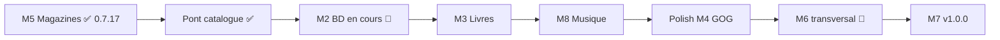
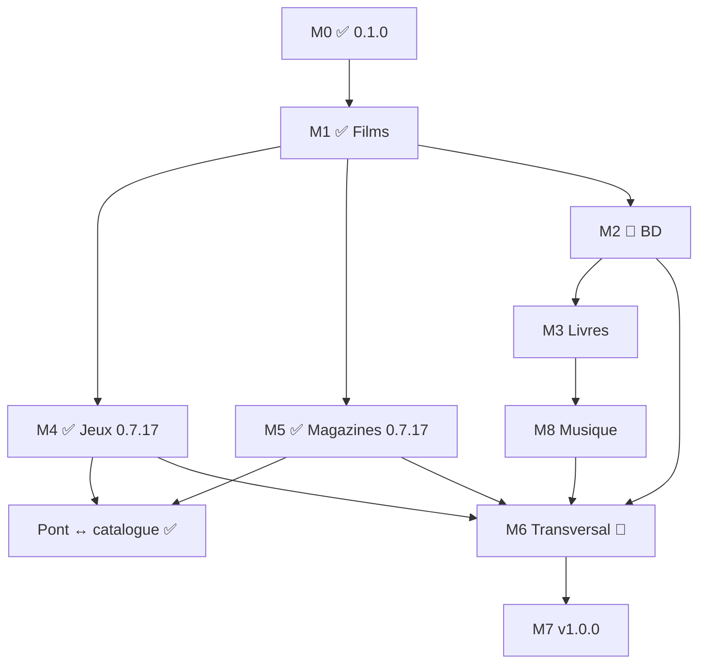

# Roadmap — Médiathèque

**Version actuelle : 0.7.32** (2026-07-20)  
**Documentation :** [doc/mediatheque.md](doc/mediatheque.md) · [CHANGELOG.md](CHANGELOG.md) · [roadmap-amelioration-code.md](roadmap-amelioration-code.md) (qualité code)

---

## Vision

Une **seule application** pour gérer films, BD/manga, livres, **musique (vinyles et CD)**, jeux vidéo et magazines, avec le **même parcours** (catalogue → collection → envies → notes) et un **changement de contexte global** via des **onglets colorés**.

**Principe :** un champ `media_domain` sur le catalogue (`oeuvres`) filtre données et écrans ; les spécificités de chaque média s’ajoutent par phases sans réécrire toute l’app.

---

## Où en est-on ? (synthèse 0.7.32)

| Domaine | Statut | Versions | Parcours catalogue → collection |
|---------|--------|----------|----------------------------------|
| **Films** | ✅ Production | 0.4.4+ → **0.7.6** | Complet (TMDB, sagas, quiz, partage, **ressentis**) |
| **Jeux** | ✅ Utilisable | 0.5.0 → **0.7.17** | Complet (IGDB, sagas, Steam, prêts, magasins catalogue, `/jeu-magazines.php`) |
| **Magazines** | ✅ Complet (M5) | 0.2.x → **0.7.17** | ABM, PDF, FTS, sujets vignettes, pont catalogue **jeu/film** |
| **BD / Manga** | 🔄 **En cours (M2)** | **0.7.2** → import CSV prêt | Collection, envies, partage, profil, impression, **import CSV** ; clôture → **0.8.0** |
| **Livres** | ⏳ Placeholder (M3) | **0.7.8** | Onglet + page « bientôt » (`/livres.php`) |
| **Musique** | ⏳ Placeholder (M8) | **0.7.8** | Onglet ambre + page « bientôt » (`/musique.php`) — vinyles et CD physiques |
| **Transversal** | 🔄 Partiel | **0.7.12**–**0.7.32** | Recherche globale, catalogue admin, import/export multi-médias, profil → fiches, partage, connexion pseudo, UI Compte/Import, menu mobile, PWA, CI |

### Phases (suivi)

| Phase | Statut | Version livrée | Suite |
|-------|--------|----------------|-------|
| **M0** Fondations multi-médias | ✅ Livré | 0.1.0 | — |
| **M1** Stabilisation films | ✅ Livré | 0.4.4 | Maintenance seulement |
| **M4** Jeux vidéo | ✅ **Livré** (polish restant) | **0.7.17** | Import GOG (voir M4) |
| **M5** Magazines | ✅ **Livré** | **0.7.17** | Maintenance ; polish ponctuel |
| **Pont** Magazines ↔ Catalogue | ✅ Livré | **0.7.17** | Jeu (0.6.3) + **film** (0.7.17) |
| **M2** BD / Manga | 🔄 **Import CSV prêt** | **0.7.2**–**0.7.16** + import | Tag **0.8.0** après validation |
| **M3** Livres | ⏳ À faire | 0.8.x (indicatif) | Après M2 stabilisée |
| **M8** Musique (vinyles, CD) | ⏳ À faire | 0.8.x+ (indicatif) | **Après M3** |
| **M6** Transversal | 🔄 **Partiel** | 0.7.14+ | Stats, import/export par domaine → **0.9.0** |
| **M7** Identité & polish | ⏳ À faire | 1.0.0 | Fin |

---

## Prochaines étapes (par priorité)

### 🔜 **0.8.0** — clôture M2 BD

- Import CSV catalogue livré en **0.7.32** — valider en usage réel puis tagger **0.8.0**.
- Ensuite : **M3 Livres**.

### ✅ **0.7.32** — BD import CSV + bibliothèque multi-médias (2026-07-20)

- Import catalogue BD CSV admin ; retrait série de la bibliothèque.
- Import/export bibliothèque tous médias ; extensions BD dans le catalogue admin.

### ✅ **0.7.31** — qualité code : dette Legacy + View URLs (2026-07-20)

- Helpers films → `FilmPresentation` ; URLs BD/magazines/jeux hors de `View`.
- CI : `upload-artifact@v7`.

### ✅ **0.7.30** — qualité code : Phase E + F (2026-07-20)

- **Phase E** : exceptions sur création de compte ; pages admin / premier compte.
- **Phase F** : Validator commun (e-mail / mot de passe) sur inscription et création.

### ✅ **0.7.29** — qualité code : Phase D tests + couverture CI (2026-07-20)

- Tests sur extractions films / SQL ; **126** fichiers de tests.
- Job CI couverture (pcov) + baseline documentée.

### ✅ **0.7.28** — qualité code : catalogue films + SQL commun (2026-07-20)

- **Phase B** : découpage de `CatalogFilmRepository` (~529 lignes).
- **Phase C** : `SqlNamedParams` / `SortColumnHelper` partagés.

### ✅ **0.7.25** — fusion catalogue jeux & liens sujets magazines (2026-07-19)

- **Fusion fiche jeu** : autocomplétion corrigée (catalogue jeux).
- **Fusion** : conservation des liens **sujet magazine ↔ fiche** et des sujets sur les numéros fusionnés.
- Correctifs badges tags / genres et plateformes à l’ajout jeu.

### ✅ **0.7.24** — magazines : tuiles épurées, correctifs filtres (2026-07-14)

- **Mes magazines** : couverture seule + bulle au survol (comme films/jeux).
- **Fiche série** : tuiles numéros compactes (couverture, n° + PDF, détails au survol).
- Correctifs affichage des **catégories** et **filtre latéral**.

### ✅ **0.7.23** — magazines : catégories de série, soluce, liens catalogue (2026-07-14)

- **Catégories de série** (Jeux vidéo, Cinéma, Figurines, Divers) + **filtre latéral** sur Mes magazines.
- **Catégorie Soluce** ; lien catalogue pour les sujets **Dossier**.

### ✅ **0.7.22** — magazines : retrait PDF numéro (2026-07-13)

- Sur la fiche numéro : **retirer** ou **remplacer** le PDF importé (le numéro reste en collection).

### ✅ **0.7.21** — icône raccourci Android, CSRF uploads (2026-07-13)

- **Android** : favicon racine + manifeste PWA pour le raccourci écran d’accueil.
- **CSRF** : uploads magazine (PDF, couverture) et fichiers joints jeu.

### ✅ **0.7.20** — correctif défilement menu mobile (2026-07-11)

- **Smartphone / iOS** : panneau menu scrollable, page figée à l’ouverture du menu.

### ✅ **0.7.19** — correctif suppression jeu catalogue, retrait enrichissement GOG/Epic (2026-07-11)

- **Catalogue admin** : suppression d’une fiche **jeu** même si l’onglet Films est actif.
- **Retrait** enrichissement automatique liens GOG/Epic (API peu fiables) ; **saisie manuelle** sur `/oeuvre-jeu.php` conservée.

### ✅ **0.7.18** — connexion pseudo, UI Compte/Import, menu navigation (2026-07-11)

- **Connexion** e-mail **ou pseudo** ; migration `064`, unicité pseudo.
- Pages **Compte** et **Importer** : bulles d’aide « i » (`_form_label_info`, `_heading_with_info`).
- Menu **Paramètres / Gestion** : fermeture au retrait de la souris (desktop).

### ✅ **0.7.17** — sujets magazine vignettes, pont catalogue multi-médias, magazines sur fiche jeu (2026-07-10)

- **Fiche numéro** : sujets reliés en **bandeau horizontal** de couvertures (défilement, bulle test/preview…).
- **Ajout de sujet** : menu **type de média** (jeu, film) ; **création automatique** d’une fiche catalogue si le titre n’existe pas.
- **Fiche jeu** : bouton **Magazines** → `/jeu-magazines.php` (grille couvertures + tags).
- **Collections films / jeux** : mode vignettes seules avec bulle au survol.
- **`MagazineSubjectCatalogLink`**, API `/rechercher-catalogue-sujet-magazine.php`.
- **Correctifs** : suppression catalogue admin (unitaire + groupée), message « Sujet retiré », recherche globale.

### ✅ **0.7.16** — séries magazines/BD catalogue complet, filtre mémorisé (2026-07-09)

- **Magazines — fiche série** : tous les numéros catalogue, compteur « X possédé(s) sur Y », sync auto.
- **BD et magazines** : filtre possession **mémorisé** dans le navigateur.
- **Catalogue admin** : redirection vers fiche catalogue après ajout film/jeu.

### ✅ **0.7.15** — catalogue admin suppression groupée, liens GOG/Epic (2026-07-08)

- **Catalogue admin** : suppression **groupée** ; pagination conservée après suppression.
- **Icônes magasins** GOG/Epic cliquables ; possession démat corrigée.
- **Import ABM** : URLs couverture avec `%20`.

### ✅ **0.7.14** — recherche globale, liens magasins catalogue (2026-07-07)

- **Recherche globale** en-tête (`/recherche.php`, `/rechercher-global.php`) — bibliothèque + catalogue, tous médias.
- **`oeuvre_store_links`** (migration 063) : liens Steam/GOG/Epic sur fiche catalogue jeu ; saisie manuelle admin.
- **`digital_stores`** = possession uniquement ; enrichissement auto GOG/Epic (base technique, pause produit).
- **Catalogue admin** : filtre par type de média.

### ✅ **0.7.13** — sagas cliquables vers catalogue pour tous (2026-07-06)

- Jaquettes saga/extensions/remakes → `/oeuvre-jeu.php` ou `/oeuvre.php` pour tout utilisateur connecté.
- **BD** : bandeau série vers `/oeuvre-bd.php` ; défilement bandeau saga jeu corrigé.

### ✅ **0.7.12** — profil → fiches catalogue, fiches harmonisées (2026-07-06)

- **Profil ami** : clic vignette → fiche **catalogue** (pas bibliothèque ami) ; cœur envies sous jaquette.
- Fiches film/BD/magazine alignées sur modèle jeu ; consultation catalogue pour tous, édition admin seulement.

### ✅ **0.7.11** — fiche jeu actions en bulles, temps manuel (2026-07-06)

- **Temps de jeu manuel** (Battle.net, Epic…) ; stats temps total vs Steam.
- Actions rapides fiche jeu en **bulles** (noter, temps, exemplaire, terminé).

### ✅ **0.7.10** — fusion catalogue, import Steam utilisateur (2026-07-05)

- **Fusion manuelle** fiches catalogue (film, jeu, magazine) ; panneau admin autocomplétion.
- **Import Steam** utilisateurs : ajout direct ou proposition catalogue + attente Mes jeux.

### ✅ **0.7.9** — import Steam, refonte fiche jeu, stats temps (2026-07-05)

- Page `/import-steam.php` ; temps Steam en liste/stats ; refonte layout fiche jeu.
- Maintenance doublons légitimes catalogue.

### ✅ **0.7.8** — Musique/Livres placeholder, refactor BD et magazines (2026-07-04)

- Onglet **Musique** (ambre) : `/musique.php`, `/musique-envies.php` — page « bientôt » (phase M8 après les livres).
- Pages **Livres** dédiées : `/livres.php`, `/livres-envies.php`.
- **Phase B qualité code** : découpage `BdRepository` (~514 lignes) et `MagazineRepository` (~481 lignes).
- **Doc** : [doc/import-musique.md](doc/import-musique.md).
- **Fix** : navigation depuis onglets placeholder vers Jeux/BD/Films… (`MediaDomainGuards`).

### ✅ **0.7.7** — Battle.net, ressentis sociaux discrets, refactor jeux (2026-07-03)

- Magasin démat **Battle.net** ; popover ressentis foyer/amis sur les fiches.
- Refactor `GameRepository` (phase B qualité code) : ~540 lignes.

### ✅ **0.7.6** — ressentis (remplace notes 1–10) (2026-06-16)

- 5 paliers de ressenti (films, jeux, BD) ; migration `057_ressenti_notes.sql`.
- Statistiques films : coups de cœur / moins aimés ; suppression note moyenne foyer.

### ✅ **0.7.5** — BD : modifier série, repli couverture tome 1 (2026-06-16)

- `/modifier-serie-bd.php` ; `SeriesPoster` (repli tome 1 / numéro 1 magazine).

### ✅ **0.7.4** — magazines HS/doublons, BD tome 0, refactor films/jeux (2026-06-16)

- Maintenance doublons magazines ; tome 0 et hors-série BD ; `FilmBulkActionService`.

### ✅ **0.7.2**–**0.7.3** — BD : partage, profil public, impression, couvertures URL (2026-06-16)

- Parité magazines/jeux : `/partage-bd.php`, profil public, `/imprimer-serie-bd.php`, couverture par URL.

### ✅ **0.7.0** — partage visiteur : recherche jeux et colonnes historique (2026-06-16)

- Filtres **plateforme / support / magasin** sur `/partage-jeux.php` (visiteurs non connectés).
- Colonnes **Note** et **Fini le** (jeux) / **Dernière vue** (films) sur listes partagées.
- Barre recherche Mes jeux sur une ligne ; filtre support physique/démat ; correctif filtre Steam/Epic (`json_each`).
- Doc : [doc/partage-visiteur.md](doc/partage-visiteur.md).

### ✅ **0.6.9** — jeux terminés, filtres recherche, icône disquette (2026-07-01)

- Fin de partie avec date (plusieurs fois) ; colonne **Fini le** ; accueil et statistiques.
- Filtres Mes jeux : type/plateforme/magasin démat ; icône **disquette/cartouche** ; fix sauvegarde jaquette `/posters/…`.

### ✅ **0.6.8** — propositions jeux au catalogue (2026-06-30)

- `/proposer-jeu.php`, validation admin, enrichissement IGDB ; plateforme **SNES** (migration 053).
- Fix insertion catalogue jeux (`oeuvres.saga`) et formulaire d’examen admin.

### ✅ **0.6.7** — partage visiteur jeux et jaquettes (2026-06-29)

- Pages `/partage-jeux.php` et `/partage-jeu.php` publiques ; jaquettes via `poster.php` sans login.
- Liens extension / jeu de base sur la fiche jeu partagée ; préfixe web `MONCINE_WEB_BASE_PATH`.

### ✅ **0.6.5** — jeux : prêts, plateformes, foyers personnels ; films : sagas catalogue (2026-06-16)

- Prêts jeux physiques, multi-plateformes, admin plateformes, foyer personnel auto.
- **Sagas films** : migration 052 — saga partagée sur `oeuvres`, héritée à l’ajout depuis le catalogue.

- Prêts de jeux physiques entre amis (migration 049, `LoanEligibility`).
- Plateformes configurables admin + multi-plateformes catalogue / « Mes plateformes » (migrations 050–051).
- Foyer personnel automatique « Mon foyer » pour comptes seuls.
- Formulaires ajout film/jeu : utilisateur non admin ne voit que les champs exemplaire après choix catalogue.

### ✅ **0.6.4** — fix navigation jeux ↔ magazines (2026-06-16)

- Liens croisés onglets Jeux / Magazines corrigés (`MediaDomainGuards`).

### ✅ **0.6.3** — pont magazine ↔ jeux (2026-06-16)

- **Rattachement rétroactif** admin (`/maintenance-magazine-jeux-liens.php`).
- **Recherche globale** magazines par titre catalogue jeu (sujets reliés).
- **Fiche catalogue jeu** : sujets magazine reliés ; doc homonymes (`doc/pont-magazine-jeu.md`).

### ✅ **0.6.2** — polish sagas jeux (2026-06-16)

- **Sagas jeux** : vue **Vignettes** (liste de sagas + jeux d’une saga).
- **Extensions** : tri chronologique sur les fiches jeu (bibliothèque et catalogue).

### ✅ **0.6.1** — clôture M5 magazines + parité jeux (2026-06-16)

- **Autocomplétion numéro** à l’ajout (`/rechercher-numeros-catalogue.php`, `addFromCatalogOeuvre`).
- **Profil public** : 5 derniers numéros (collection / envies).
- **Export JSON** catalogue (`/export-catalogue-magazines.php`).
- **Recherche admin** catalogue : n° magazine et titre de série.
- **Jeux — partage visiteur** : liens collection / envies (`/partage-jeux.php`, `/gerer-partages.php?domain=jeu`).
- **Jeux — listes imprimables** : `/imprimer-jeux.php`, `/imprimer-envies-jeux.php`.

### ✅ **0.6.0** — import catalogue magazines ABM (2026-06-16)

- **Import ABM** : CLI `abm-fetch-catalog.php` / `abm-import-catalog.php`, page admin `/import-catalogue-magazines.php`.
- **Ajout série catalogue** : autocomplétion, rattachement des numéros en non possédés.
- **Retrait série** : collection et envies sans toucher au catalogue partagé.
- **Dates** : libellés français (`mars 2018`, `juillet / août`) → dates ISO.
- **Couvertures** : téléchargement par lots (20 par défaut) pour ne pas surcharger ABM.

### ✅ **0.5.7** — vue Bibliothèque et enrichissements jeux (2026-06-16)

- **Vue Bibliothèque** (`?view=shelf`) sur Mes films et Mes jeux : tranches verticales (190 px), aperçu vignette au survol, collection entière sur une page.
- **Enrichissement IGDB** : option « Garder la jaquette » lors d’un enrichissement ou d’une correction.
- **Recherche jeux** : acronymes IGDB (`alternative_names`, ex. GTA, BotW) dans Mes jeux et le catalogue.
- **Partage visiteur** : mode Bibliothèque sur les liens `/partage.php`.

### ✅ **0.5.6** — sagas jeux et doc base de données (2026-06-16)

- Page **Sagas jeux** (`/sagas-jeux.php`) : liste, détail trié par année, renommage, jaquettes.
- **`GameFranchiseRepository`** : assignation en masse depuis « Mes jeux », autocomplétion saga.
- **Documentation** : [doc/base-de-donnees.md](doc/base-de-donnees.md) (structure SQLite, maintenance).
- **Correctif** : filtre genre statistiques → Mes jeux pour jeux multi-genres.

### ✅ **0.5.5** — enrichissement IGDB jeux (2026-06-16)

- Enrichissement catalogue jeux via IGDB (comme TMDB pour les films) : jaquette locale, titres FR/EN, studio, éditeur, genres, franchise, modes, thèmes, acronymes.
- Migrations **046–047** ; refactor modules jeux (`GameSchema`, `GameRowMapper`, …).

### ✅ Consolidation **0.5.4** — livré (2026-06-16)

- QA prod : remakes, affichage extensions/remakes, recherche tolérante, migrations **044–045**.
- Tag Git **`v0.5.4`** — publié sur `origin/main`.

### Priorité 1 — **Pont magazine ↔ catalogue** ✅ livré (0.6.3 → **0.7.17**)

4. ~~**Rattachement rétroactif**~~ — `/maintenance-magazine-jeux-liens.php`
5. ~~**Recherche globale**~~ — titre catalogue pour sujets reliés
6. ~~Documenter les cas ambigus~~ — `doc/pont-magazine-jeu.md`
7. ~~**Lien film** + création auto catalogue à l’ajout de sujet~~ — **0.7.17**
8. ~~**Page `/jeu-magazines.php`** + bandeau sujets vignettes~~ — **0.7.17**

### Priorité 2 — Clôturer **M2 BD** puis **M3 Livres**

9. **M2** — import CSV BD (`doc/import-bd.md`) — seul bloc restant pour **0.8.0**.
10. **M3 Livres** — schéma `oeuvre_livre`, ISBN, collection papier.

### Priorité 3 — Polish **M4** (non bloquant)

11. **Import bibliothèque GOG** — voir [doc/import-gog.md](doc/import-gog.md) (catalogue existant uniquement).
12. **Enrichissement liens magasins** (GOG/Epic, API publiques) — base en **0.7.14** ; voir [doc/enrichissement-magasins.md](doc/enrichissement-magasins.md).

### Priorité 4 — **M8 Musique** (après M3 Livres)

13. Bibliothèque **physique** : vinyles et CD (pas de streaming).
14. Schéma `oeuvre_musique` : artiste, album, année, label, supports (vinyle 33/45, CD…).
15. Même parcours que les autres médias : catalogue → collection → envies → ressentis → prêts physiques.

### Priorité 5 — **M6** Transversal (domaines alignés)

16. Statistiques par domaine (libellés « vu » / « joué » / « lu » / « écouté »).
17. Partage visiteur avec paramètre `media_domain` unifié.
18. Import / export CSV par domaine.
19. Prêts : règles par type de média (physique uniquement ; pas de prêt PDF/démat).

**Déjà livré (partiel M6) :** recherche globale (**0.7.14**), catalogue admin multi-médias + suppression groupée (**0.7.15**–**0.7.17**), profil → fiches catalogue (**0.7.12**).

### Priorité 6 — **M7 → 1.0.0**

20. Documentation par média, déploiement, polish identité (namespace `Moncine\` conservé jusqu’alors).



---

## Architecture cible

```text
┌──────────────────────────────────────────────────────────────────────┐
│  Onglets : Films │ BD │ Livres │ Musique │ Jeux │ Magazines          │
│  (session + thème CSS --media-accent)                                │
└──────────────────────────┬───────────────────────────────────────────┘
                           │
     ┌─────────────────────┼─────────────────────┐
     ▼                     ▼                     ▼
  Catalogue            Ma collection          Mes envies
  (oeuvres)            (bibliotheque)       (wishlist)
     │                     │                     │
     └──────── media_domain = film | bd | livre | musique | jeu | magazine
                           │
     Foyers, comptes, amis, prêts, notifications… (commun)
```

### Identique d’un média à l’autre (objectif final)

Comptes, foyers, envies personnelles et de groupe, catalogue partagé, soumissions, historique / notes, recherche collection & catalogue, partage visiteur, prêts (physique), import/export, listes imprimables, affiches, EAN, notifications, maintenance SQLite.

### Spécifique par média

| Élément | Films | BD/Manga | Livres | Musique | Jeux | Magazines |
|---------|-------|----------|--------|---------|------|-----------|
| Enrichissement | TMDB / OMDB | Manuel (+ API plus tard) | ISBN / Open Library | Manuel (+ Discogs plus tard) | IGDB | — |
| Métadonnées clés | Réalisateur, acteurs | Série, tome, auteurs | Auteur, ISBN | Artiste, album, label | Plateforme, éditeur | N°, parution |
| Support exemplaire | DVD, Blu-ray… | Album, relié… | Broché, poche… | Vinyle, CD… | Boîte, démat… | **PDF** |
| Outil dédié | Quiz « Ce soir » | — | — | — | — | Lecteur + recherche PDF |
| Lien inter-domaines | — | — | — | — | Tests magazine → fiche jeu/film ; `/jeu-magazines.php` | Sujets → catalogue **jeu ou film** |
| Sagas | Sagas films | Séries BD | Collections | Discographie / artiste | Franchises + extensions | Titre de revue |

### Palette couleurs (M0)

| Domaine | Accent |
|---------|--------|
| Films | `#adb5bd` (gris) |
| BD / Manga | `#f06292` (rose) |
| Livres | `#64b5f6` (bleu) |
| Musique | `#ffca28` (ambre) |
| Jeux | `#9575cd` (violet) |
| Magazines | `#4db6ac` (vert d’eau) |

---

## Phases livrées

### M0 — Fondations multi-médias ✅ (0.1.0)

- Migration `030_media_domain.sql`, onglets, `MediaDomain` / `MediaContext` / `MediaDomainGuards`
- Thème CSS par domaine, collections séparées par `media_domain` dans le même foyer
- Tests `MediaDomainTest`

### M1 — Stabilisation films ✅ (0.4.4 — QA prod 2026-06-09)

**Objectif atteint :** onglet Films = Monciné 1.0.0 sans régression bloquante.

| Bloc QA | Statut |
|---------|--------|
| Navigation, collection, fiche, ajout/suppression | ✅ |
| Enrichissement TMDB/OMDB, envies, quiz | ✅ |
| Sagas, stats, import/export, prêts, partage, social, admin | ✅ |

Correctifs M1 livrés : grille homogène (M1-001), pagination 56 vignettes / 100 liste (M1-002).

Détail complet : archives QA dans l’historique git avant cette réorganisation.

---

## M4 — Jeux vidéo ✅ Livré (0.5.4)

**Documentation :** [doc/jeux.md](doc/jeux.md)

### Livré

| Tâche | Version |
|-------|---------|
| Schéma `oeuvre_jeu`, exemplaires, Linux (`039`–`043`) | 0.5.0 |
| Extensions DLC / add-on (`044`, `is_extension`, `base_game_oeuvre_id`) | 0.5.2 |
| Collection, envies, notes, accueil `home-jeu.php` | 0.5.0 |
| Fichiers attachés, vue vignettes, icônes support, Linux tri-état | 0.5.1 |
| API `/rechercher-jeux-catalogue.php` | 0.5.0 |
| Pont magazine UI (`MagazineGameLink`, section « Revues » sur fiche jeu) | 0.5.0 |
| Catalogue admin multi-médias, export/import `media_domain` | 0.5.2 |
| Fiches catalogue `/oeuvre-jeu.php`, édition admin, ajout bibliothèque | 0.5.3 |
| Autocomplétion à l’ajout collection (`/ajouter-jeu.php`) | 0.5.3 |
| Extensions DLC + remakes, liens jaquettes | **0.5.4** |
| Recherche / autocomplétion tolérante (`SearchMatch`) | **0.5.4** |
| Statistiques enrichies (`GameCollectionStats`, `GameListFilter`) | 0.5.3 |
| Profil public onglet Jeux | 0.5.3 |
| Import Steam bibliothèque (`/import-steam.php`) | **0.7.9**–**0.7.10** |
| Fusion manuelle fiches catalogue | **0.7.10** |
| Temps de jeu manuel + stats total/Steam | **0.7.11** |
| Fiches catalogue consultables (tous connectés) ; profil → catalogue | **0.7.12** |
| Sagas/extensions cliquables vers catalogue (films, jeux, BD) | **0.7.13** |
| Liens magasins catalogue (`oeuvre_store_links`) ; recherche globale | **0.7.14** |
| Page **Magazines** sur fiche jeu (`/jeu-magazines.php`) | **0.7.17** |

**Critère de sortie M4 :** ✅ atteint — collection + envies ; catalogue partagé ; pont magazine opérationnel ; parité films sur le parcours principal.

### Polish restant (non bloquant)

| Tâche | Cible | Statut |
|-------|-------|--------|
| **Import bibliothèque GOG** (catalogue existant uniquement) | 0.8.x — voir [doc/import-gog.md](doc/import-gog.md) | ⏳ |
| **Enrichissement auto liens magasins** (GOG/Epic) | base **0.7.14** ; saisie manuelle prioritaire | ⏳ |
| Plateformes configurables (admin) | 0.6.5 | ✅ |
| Flag « non prêtable » si démat | migration 049 | ✅ |

---

## M5 — Magazines ✅ Livré (0.6.1)

**Documentation :** [doc/magazines.md](doc/magazines.md)

### Livré

| Tâche | Version |
|-------|---------|
| Séries + numéros (`series`, `oeuvre_magazine`) | 0.2.0 |
| Upload / lecture PDF, tags papier/PDF | 0.2.1 |
| Texte PDF, couverture auto (Poppler) | 0.2.1 |
| Sujets tests/previews, FTS globale | 0.4.0–0.4.1 |
| Maintenance sujets, hors-série, année sujet | 0.4.2–0.4.3 |
| Fiche catalogue `/oeuvre-magazine.php`, ajout bibliothèque | 0.5.3 |
| Import / export catalogue ABM + JSON admin | **0.6.0–0.6.1** |
| Ajout série / numéro depuis catalogue (autocomplétion) | **0.6.0–0.6.1** |
| Retrait série bibliothèque | **0.6.0** |
| Profil public (numéros récents, séries, fiches lecture seule) | **0.6.1** |
| Recherche admin catalogue (n°, série) | **0.6.1** |
| Séries : catalogue complet, filtre possession mémorisé | **0.7.16** |
| Sujets en bandeau vignettes ; pont catalogue jeu/**film** ; création auto | **0.7.17** |

**Critère de sortie M5 :** ✅ atteint — parcours catalogue → collection aligné sur films/jeux.

---

## Pont Magazines ↔ Catalogue ✅ Livré (0.6.3 → **0.7.17**)

Relier optionnellement un sujet magazine à une fiche **jeu ou film** catalogue (`magazine_subject.catalog_oeuvre_id` → `oeuvres`).

### Livré

| Tâche | Version |
|-------|---------|
| Migration `catalog_oeuvre_id` | 0.5.0 |
| Autocomplétion jeux à l’ajout d’un sujet test/preview/interview | 0.5.0 |
| Affichage croisé fiche jeu ↔ sujets / numéros | 0.5.0 |
| Fiches catalogue jeux partagées (`/oeuvre-jeu.php`) | 0.5.3 |
| Rattachement rétroactif sujets existants (outil admin) | 0.6.3 |
| Recherche globale par titre catalogue (sujets reliés) | 0.6.3 |
| Doc homonymes (`doc/pont-magazine-jeu.md`) | 0.6.3 |
| **Lien film** ; menu type de média ; création auto fiche catalogue | **0.7.17** |
| **`MagazineSubjectCatalogLink`**, `/rechercher-catalogue-sujet-magazine.php` | **0.7.17** |
| Bandeau vignettes sujets sur fiche numéro | **0.7.17** |
| Page `/jeu-magazines.php` (tous numéros catalogue) | **0.7.17** |

**Règles inchangées :** lien optionnel ; sujets sans lien restent valides ; tags série (PS5, PC…) = contexte revue, pas identité du média catalogue.

---

## M2 — BD / Manga 🔄 En cours

**Documentation :** [doc/bd.md](doc/bd.md)  
**Version visée (clôture) :** 0.8.0 (indicatif)

### Livré (0.7.2 → **0.7.16** + import CSV)

| Tâche | Version |
|-------|---------|
| Schéma `oeuvre_bd`, séries, tomes, collection, envies | 0.7.x |
| Profil public, partage visiteur, liste imprimable | **0.7.2** |
| Couverture par URL, possession à l’ajout | **0.7.3** |
| Tome 0, hors-série, modifier série | **0.7.4**–**0.7.5** |
| Ressentis (comme films/jeux) | **0.7.6** |
| Découpage `BdRepository` (phase B qualité code) | **0.7.8** |
| Filtre possession mémorisé (aligné magazines) | **0.7.16** |
| **Import CSV catalogue** (`BdCatalogImporter`, `/import-catalogue-bd.php`) | **livré (0.7.32)** — tag **0.8.0** après validation terrain |

### Reste à faire

| Tâche | Détail |
|-------|--------|
| Tag / release **0.8.0** | Clôture M2 officielle après validation terrain de l’import CSV |
| Export CSV BD (optionnel) | Aller-retour export/import |

**Critère de sortie :** onglet BD utilisable sans API externe — **atteint** avec l’import CSV.

---

## M3 — Livres ⏳ À faire

**Version visée (indicatif) :** 0.8.x

| Tâche | Détail |
|-------|--------|
| Schéma | Table `oeuvre_livre` : auteur(s), ISBN, pages, éditeur |
| Stockage | `MediaStorage::SUBDIR_BOOKS` |
| Import | `doc/import-livres.md` |
| Onglet | Placeholder `/livres.php` (déjà en place, **0.7.8**) |

**Critère de sortie :** livres papier en collection.

---

## M8 — Musique (vinyles, CD) ⏳ À faire — après M3

**Version visée (indicatif) :** 0.8.x+ (après livres)

Gestion d’une **bibliothèque physique** : disques vinyle (33 tours, 45 tours, maxi…) et **CD**, sans lecture ni streaming intégré.

| Tâche | Détail |
|-------|--------|
| Onglet placeholder | `/musique.php` — **livré en 0.7.8** (couleur ambre, page « bientôt ») |
| Schéma | Table `oeuvre_musique` : artiste, album, année, label, genre ; lien éventuel discographie |
| Supports exemplaire | Vinyle, CD, cassette (optionnel) ; pas de fichier numérique |
| Collection | `media_domain = musique` — même parcours que films/BD |
| Catalogue | Saisie manuelle ; enrichissement Discogs / MusicBrainz **plus tard** |
| Fonctions | Collection, envies, ressentis, prêts **physiques**, partage visiteur, listes imprimables |
| Import | [doc/import-musique.md](doc/import-musique.md) |

**Critère de sortie :** vinyles et CD en collection avec prêts physiques, sans API obligatoire.

**Hors périmètre v1 :** streaming (Spotify, etc.), fichiers MP3/FLAC, gestion des playlists.

---

## M6 — Fonctions transverses 🔄 Partiel

**Version visée :** 0.9.0 — après films, jeux, magazines, BD, livres et musique alignés.

| Module | Adaptation | Statut |
|--------|------------|--------|
| **Recherche globale** | Barre en-tête, bibliothèque + catalogue | ✅ **0.7.14** |
| **Catalogue admin** | Filtre média, suppression groupée, fusion fiches | ✅ **0.7.10**–**0.7.17** |
| **Profil public → catalogue** | Fiches consultables, envies sous jaquette | ✅ **0.7.12** |
| Statistiques | Filtre domaine ; libellés selon média (vu / joué / lu / écouté) | ⏳ |
| Prêts | Physique uniquement ; pas de prêt PDF/démat | ⏳ (jeux/films ✅) |
| Partage | Paramètre domaine dans le lien | ⏳ (films/jeux/BD partiels) |
| Import / export | Schéma CSV par domaine | ⏳ |
| Soumissions | Formulaire selon onglet actif | ⏳ |
| Listes imprimables | Colonnes par domaine | ⏳ (films/jeux/BD/magazines ✅) |
| Notifications | Types par domaine | ⏳ |
| Maintenance | Stats et nettoyage PDF orphelins | ⏳ |

---

## M7 — Identité & version 1.0.0 ⏳

| Tâche | Détail |
|-------|--------|
| Nom & logo | « Médiathèque » (déjà en place) |
| Variables env | Alias `MEDIATHEQUE_*` optionnels |
| Namespace PHP | Garder `Moncine\` sauf décision contraire |
| Documentation | Guide par média dans `doc/` |
| Déploiement | Notes YunoHost / serveur classique |

---

## Décisions actées

| Sujet | Décision |
|-------|----------|
| Métadonnées spécifiques | **Tables filles** (`oeuvre_jeu`, `oeuvre_magazine`, …) — pas de gros JSON |
| URL / onglet | **Session** + `set-media-domain.php` |
| Foyer | **Une collection par domaine** dans le même foyer |
| Quiz | **Films uniquement** |
| Code Monciné | Namespace **`Moncine\`**, **`MONCINE_*`**, **`moncine.db`** — ne pas renommer avant M7 → [doc/conventions-techniques.md](doc/conventions-techniques.md) |
| Sujets magazine vs catalogue | Lien **optionnel** vers **jeu ou film** ; pas de rupture des données prod |

---

## Dépendances entre phases



---

## Risques & mitigations

| Risque | Mitigation |
|--------|------------|
| Régression dvdthèque | M1 checklist + PHPUnit |
| Multiplication `if (domaine)` | `MediaDomain`, `CatalogSchema`, guards |
| PDF lourds | Hors `www/`, limites upload, FTS optionnelle |
| APIs instables | Saisie manuelle d’abord |
| Sujets magazine sans lien catalogue | Lien optionnel ; rattachement progressif |

---

## Estimation (indicative, mise à jour 0.7.17)

| Phase | Effort restant | Version |
|-------|----------------|---------|
| M0, M1, M4, M5, Pont | ✅ fait | 0.1.0 → **0.7.17** |
| M6 (partiel) | recherche globale, catalogue admin, profil | **0.7.14**–**0.7.17** ✅ |
| M2 clôture (import CSV BD) | ~1 semaine | **0.8.0** |
| M3 Livres | ~2 semaines | 0.8.x |
| M8 Musique | ~2 semaines | 0.8.x+ |
| Polish M4 (GOG) | quelques jours | 0.8.x |
| M6 (reste) | 2–3 semaines | **0.9.0** |
| M7 | 1 semaine | **1.0.0** |

---

## Références code

| Sujet | Fichiers |
|-------|----------|
| Domaine média | `lib/MediaDomain.php`, `lib/MediaContext.php`, `lib/MediaDomainGuards.php` |
| Collection films | `lib/FilmRepository.php`, `lib/CatalogFilmRepository.php` |
| Jeux (M4) | `lib/GameRepository.php`, `lib/GameListFilter.php`, `lib/GameCollectionStats.php`, `doc/jeux.md` |
| Fiches catalogue jeux | `www/oeuvre-jeu.php`, `templates/oeuvre-jeu.php` |
| BD (M2) | `lib/BdRepository.php`, `lib/BdLibraryQuery.php`, … |
| Magazines (M5) | `lib/MagazineRepository.php`, `lib/MagazineLibraryQuery.php`, `doc/magazines.md` |
| Fiches catalogue magazines | `www/oeuvre-magazine.php`, `templates/oeuvre-magazine.php` |
| Pont magazine ↔ catalogue | `lib/MagazineSubjectCatalogLink.php`, `lib/MagazineGameLink.php`, `lib/MagazineSubjectRepository.php`, `www/jeu-magazines.php` |
| Recherche globale | `lib/GlobalSearch.php`, `www/recherche.php`, `www/rechercher-global.php` |
| Liens magasins catalogue | `lib/CatalogGameStoreLinks.php`, `lib/OeuvreStoreLinkRepository.php`, migration `063` |
| Catalogue admin | `lib/CatalogAdmin.php`, `www/catalogue.php`, `lib/View.php` (`catalogOeuvreDetailUrl`) |
| UI onglets | `templates/_media_domain_tabs.php`, `templates/layout.php` |
| Conventions dev | [doc/conventions-techniques.md](doc/conventions-techniques.md) |

*Dernière mise à jour : **0.7.32** — 2026-07-20 (BD import CSV + bibliothèque multi-médias).*
