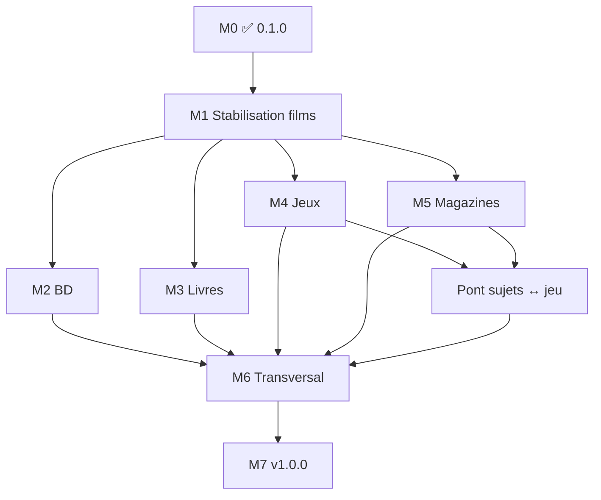

# Roadmap — Médiathèque

**Version actuelle : 0.4.4** (2026-06-09)  
**Documentation :** [doc/mediatheque.md](doc/mediatheque.md) · [CHANGELOG.md](CHANGELOG.md)

---

## Vision

Une **seule application** pour gérer films, BD/manga, livres, jeux vidéo et magazines, avec le **même parcours** (catalogue → collection → envies → notes) et un **changement de contexte global** via des **onglets colorés**.

**Principe :** un champ `media_domain` sur le catalogue (`oeuvres`) filtre données et écrans ; les spécificités de chaque média s’ajoutent par phases sans réécrire toute l’app.

---

## État des phases (suivi)

| Phase | Statut | Version cible | Résumé |
|-------|--------|---------------|--------|
| **M0** Fondations multi-médias | ✅ **Livré** (0.1.0) | 0.1.0 | Onglets, couleurs, `media_domain`, films filtrés |
| **M1** Stabilisation films | ✅ **Livré** (0.4.4) | 0.4.4 | QA prod complète (2026-06-09) ; grille + pagination |
| **M2** BD / Manga | ⏳ À faire | 0.3.x | Collection BD, séries/tomes |
| **M3** Livres | ⏳ À faire | 0.4.x | ISBN, auteur, import CSV |
| **M4** Jeux vidéo | ⏳ À faire | 0.5.x | Catalogue jeux, collection ; lien futur avec sujets magazines |
| **M5** Magazines | 🔄 **En cours** | 0.4.x → 0.6.0 | Séries, numéros, PDF, sujets/tests, FTS (**0.4.1**) |
| **M6** Transversal | ⏳ À faire | 0.9.x | Prêts, partage, stats par domaine |
| **M7** Identité & polish | ⏳ À faire | 1.0.0 | Branding, doc finale, déploiement |

---

## Livré en 0.1.0 (phase M0)

### Données

- [x] Migration **`030_media_domain.sql`** — colonne `oeuvres.media_domain` (défaut `film`)
- [x] Index `idx_oeuvres_media_domain`
- [x] Schéma frais `sql/schema.sql` aligné
- [x] Règle foyer : **même foyer**, collections **séparées par domaine** (filtrage sur `oeuvres`)

### Code PHP

- [x] `MediaDomain` — constantes, couleurs, libellés navigation
- [x] `MediaContext` — domaine actif en session
- [x] `MediaDomainGuards` — page « bientôt », pages réservées aux films, URL après changement d’onglet
- [x] `CatalogSchema::applyMediaDomainFilter()` — filtre SQL central
- [x] Dépôts mis à jour : collection, catalogue admin, bibliothèque, envies groupe, partage, profil public

### Interface

- [x] Onglets `templates/_media_domain_tabs.php` + `www/set-media-domain.php`
- [x] Thème CSS par domaine (accent, barre, en-tête, fond)
- [x] Pastille couleur par onglet ; onglet actif mis en évidence
- [x] Libellés dynamiques (Mes films / Mes BD…)
- [x] « Ce soir » masqué hors onglet Films

### Qualité

- [x] Tests `MediaDomainTest` (unitaire + intégration)
- [x] Correctifs : quiz ↔ changement d’onglet, `$foyer` sur page compte
- [x] `.gitignore` données locales et graine volumineuse

### Palette couleurs (0.1.0)

| Domaine | Accent | Usage |
|---------|--------|--------|
| Films | `#adb5bd` (gris) | Dvdthèque — neutre |
| BD / Manga | `#f06292` (rose) | — |
| Livres | `#64b5f6` (bleu) | — |
| Jeux | `#9575cd` (violet) | — |
| Magazines | `#4db6ac` (vert d’eau) | — |

---

## Architecture cible

```text
┌─────────────────────────────────────────────────────────────┐
│  Onglets : Films │ BD │ Livres │ Jeux │ Magazines           │
│  (session + thème CSS --media-accent)                       │
└──────────────────────────┬──────────────────────────────────┘
                           │
     ┌─────────────────────┼─────────────────────┐
     ▼                     ▼                     ▼
  Catalogue            Ma collection          Mes envies
  (oeuvres)            (bibliotheque)       (wishlist)
     │                     │                     │
     └──────── media_domain = film | bd | … ────┘
                           │
     Foyers, comptes, amis, prêts, notifications… (commun)
```

### Identique d’un média à l’autre (objectif final)

Comptes, foyers, envies personnelles et de groupe, catalogue partagé, soumissions, historique / notes, recherche collection & catalogue, partage visiteur, prêts (physique), import/export, listes imprimables, affiches, EAN, notifications, maintenance SQLite.

### Spécifique par média

| Élément | Films | BD/Manga | Livres | Jeux | Magazines |
|---------|-------|----------|--------|------|-----------|
| Enrichissement | TMDB / OMDB | Manuel (+ API plus tard) | ISBN / Open Library | IGDB | — |
| Métadonnées clés | Réalisateur, acteurs | Série, tome, auteurs | Auteur, ISBN | Plateforme, éditeur | N°, parution |
| Support exemplaire | DVD, Blu-ray… | Album, relié… | Broché, poche… | Boîte, démat… | **PDF** |
| Outil dédié | Quiz « Ce soir » | — | — | — | Lecteur + recherche PDF |
| Lien inter-domaines | — | — | — | **Tests magazine → fiche jeu** (M4+) | **Sujets → catalogue jeu** (M4+) |
| Sagas | Sagas films | Séries BD | Collections | Franchises | Titre de revue |

---

## Phase M1 — Stabilisation films ✅ **Clôturée (0.4.4 — 2026-06-09)**

**Objectif :** confirmer que l’onglet Films = Monciné 1.0.0 sans régression — **atteint** (QA production complète).

**Version roadmap d’origine :** `0.2.0` · **Livré dans la lignée Médiathèque :** `0.4.4`

### Suivi QA (tests manuels — production, 2026-06-09)

| Bloc | Statut | Détail |
|------|--------|--------|
| A — Prérequis | ✅ | Connexion, onglet Films, admin |
| B — Navigation & multi-médias | ✅ | Onglets, quiz, menu « Ce soir » |
| C — Collection | ✅ | Grille homogène (M1-001), recherche, tri, filtres, pagination (M1-002) |
| D — Fiche film | ✅ | D1–D6 |
| E — Ajout / suppression | ✅ | E1–E4 |
| F — Enrichissement | ✅ | F1–F4 (TMDB / OMDB) |
| G — Envies | ✅ | G1–G3 |
| H — Quiz « Ce soir » | ✅ | H1–H4 |
| I — Sagas, personnes, support | ✅ | I1–I3 |
| J — Statistiques | ✅ | J1–J2 |
| K — Import / export | ✅ | K1–K3 |
| L — Prêts | ✅ | L1–L3 |
| M — Partage visiteur | ✅ | M1–M3 |
| N — Social | ✅ | N1–N5 |
| O — Admin catalogue | ✅ | O1–O5 |
| P — Compte | ✅ | P1–P4 |
| Q — Inscription | ✅ | Q1–Q2 |
| R — Listes imprimables | ✅ | R1–R2 |

**Verdict QA fonctionnelle :** aucune régression bloquante constatée sur l’onglet Films en production.

### Anomalies identifiées (corrigées)

| ID | Page / test | Statut | Description |
|----|-------------|--------|-------------|
| **M1-001** | `/films.php` — vue grille (C1) | ✅ Validé prod | Tuiles inhomogènes — flex colonne, hauteur titre/notes réservée |
| **M1-002** | `/films.php` — pagination (C5) | ✅ Validé prod | Pagination **56** vignettes (7×8) / **100** films en liste |

### Checklist fonctionnelle

- [x] **Collection** — liste, tri, recherche, filtres type (film/série/doc…) — validé prod 2026-06-09
- [x] **Fiche film** — affichage, modification, notes, historique vision
- [x] **Ajout / suppression** — collection et envies
- [x] **Enrichissement** — TMDB, OMDB, affiches
- [x] **Envies** — personnelles, cibles support/EAN, envies du groupe
- [x] **Quiz & résultat** — tirage, exclusion, changement d’onglet OK
- [x] **Sagas, personnes, support** — navigation et filtres
- [x] **Statistiques** — compteurs, temps de vision
- [x] **Import / export** — CSV bibliothèque et catalogue
- [x] **Prêts** — demande, acceptation, retour
- [x] **Partage visiteur** — liens collection / envies
- [x] **Social** — amis, groupe, profil public
- [x] **Admin** — catalogue, soumissions, maintenance, sauvegarde base
- [x] **Compte** — profil, mot de passe, suppression compte
- [x] **Inscription** — si activée

### Checklist technique

- [x] **`media_domain = film`** — migration `030` (défaut + `UPDATE`) ; filtre `CatalogSchema::applyMediaDomainFilter()` sur collection films
- [x] **Soumissions catalogue** — `OeuvreRepository` : `media_domain` depuis `MediaContext` (défaut onglet Films)
- [x] **Import CSV** — création œuvres via `OeuvreRepository` / contexte Films (domaine `film` implicite)
- [x] **Tests** — `FilmCollectionPaginationTest` ; suite existante `MediaDomainTest`, intégration films
- [x] **Documentation** — [doc/mediatheque.md](doc/mediatheque.md) § M1 clôturée

**Critère de sortie M1 :** ✅ atteint — QA prod (2026-06-09) + correctifs livrés en **0.4.4**.

| Livrable M1 (films) | Version | Détail |
|---------------------|---------|--------|
| QA fonctionnelle prod | ✅ 0.4.4 | Blocs A–R validés (2026-06-09) |
| Grille homogène | ✅ 0.4.4 | Tuiles alignées (M1-001) |
| Pagination collection | ✅ 0.4.4 | 56 vignettes (7×8) / 100 en liste (M1-002) |

---

## Phase M2 — BD / Manga

**Version visée :** `0.3.0`

| Tâche | Détail |
|-------|--------|
| Schéma | Table `oeuvre_bd` (ou équivalent) : série, tome, scénariste, dessinateur, éditeur, type manga/bd/comics |
| Formulaires | Ajout / édition œuvre BD ; masquer champs « réalisateur TMDB » |
| Collection | `findAll` / fiche / envies avec `media_domain = bd` |
| Séries | Réutiliser `saga` ou champ série dédié |
| Affiches | `PosterStorage` (évent. sous-dossier `posters/bd/`) |
| Import | CSV BD documenté (`doc/import-bd.md`) |
| Enrichissement | Optionnel : AniList / BNF (phase ultérieure) |

**Critère de sortie :** onglet BD utilisable sans API externe.

---

## Phase M3 — Livres

**Version visée :** `0.4.0`

| Tâche | Détail |
|-------|--------|
| Schéma | `oeuvre_livre` : auteur(s), ISBN, pages, éditeur, collection |
| Stockage | `MediaStorage::SUBDIR_BOOKS` pour pièces jointes futures |
| Formulaires & listes | Domaine `livre` |
| Import | `doc/import-livres.md` + colonnes CSV |

**Critère de sortie :** livres papier en collection (pas d’obligation ebook).

---

## Phase M4 — Jeux vidéo

**Version visée :** `0.5.0`

| Tâche | Détail |
|-------|--------|
| Schéma | `oeuvre_jeu` : studio, genre, plateforme (Steam, PSN…), mode physique/démat |
| Catalogue | `oeuvres` + `media_domain = jeu` ; fiche jeu partagée (comme films / magazines) |
| Exemplaire | Boîte, édition ; flag « non prêtable » si démat |
| Listes | Plateformes configurables |
| Prérequis lien magazines | Catalogue jeux stable **avant** le pont sujets magazine (voir § Pont Magazines ↔ Jeux) |

**Critère de sortie :** collection + envies jeux physiques et démat ; fiches jeu consultables et recherchables dans l’onglet Jeux.

---

## Pont Magazines ↔ Jeux vidéo (transversal M4 + M5)

**Version visée :** `0.5.x` ou `0.6.x` — **après** le catalogue jeux (M4) et les sujets magazines (M5 ✅ depuis 0.4.0).

### Contexte

Les **sujets magazines** (`magazine_subject`, tests / previews / interviews…) sont aujourd’hui identifiés par :

- catégorie (Test, Preview, Comparatif, Dossier, Interview) ;
- **libellé** saisi (ex. « Gran Turismo 7 ») ;
- **tag de série** (`series.tags` → champ `detail`, ex. PS5) ;
- **année** du numéro (`parution_year`).

Les **tags de série** (PC, PS5…) décrivent le **contexte de la revue**, pas l’identité du jeu. Le **lien catalogue** portera sur le **libellé du sujet** (jeu testé), pas sur ces tags.

### Objectif

Relier optionnellement un sujet magazine à une **fiche jeu du catalogue** (`oeuvres.id`, `media_domain = jeu`) pour :

- depuis un **jeu** : lister tests, previews et interviews parus dans les magazines ;
- depuis un **sujet / numéro** : ouvrir la fiche jeu canonique ;
- réduire les doublons d’orthographe tout en gardant année + tag plateforme sur l’article.

### Modèle cible (anticipation)

| Élément | Décision |
|---------|----------|
| Lien | Colonne nullable `magazine_subject.catalog_oeuvre_id` → `oeuvres(id)` (jeu uniquement) |
| Saisie | Autocomplétion catalogue jeux à l’ajout d’un sujet **Test / Preview / Interview** ; saisie libre conservée |
| Unicité actuelle | Inchangée : `(category, label, detail, parution_year)` — plusieurs sujets peuvent pointer vers **le même** jeu |
| Données prod existantes | **Non bloquantes** : sujets déjà saisis restent valides ; rattachement progressif (migration assistée ou UI admin) |
| Hors périmètre jeu | Dossiers, comparatifs matériel, sujets voiture… restent en texte libre sans lien catalogue |

### Tâches prévues

| Tâche | Phase | Détail |
|-------|-------|--------|
| Migration | M4+ | `catalog_oeuvre_id` nullable + index ; contrôle `media_domain = jeu` |
| Saisie fiche numéro | M5+ | Autocomplétion jeux (API JSON) en complément de l’autocomplétion sujets existants |
| Fiche jeu | M4 | Section « Revues » : numéros / sujets liés dans la bibliothèque du foyer |
| Fiche sujet magazine | M5+ | Lien vers fiche jeu si `catalog_oeuvre_id` renseigné |
| Rattachement rétroactif | M5+ | Outil ou script : matcher libellés existants → fiches jeu (revue manuelle des cas ambigus) |
| Recherche | M5+ | FTS / recherche globale : remonter aussi par titre catalogue jeu |

### Compatibilité des données déjà en production

- Les sujets créés **sans** lien catalogue continueront de fonctionner (recherche, fiche sujet, export).
- Pas de ressaisie obligatoire : le lien est un **enrichissement** optionnel.
- Doublons texte proches déjà limités (`normalizeLabelKey`, autocomplétion) ; le catalogue jeu renforce la cohérence **sans supprimer** l’historique magazine (année, tag PS5/PC, catégorie test vs preview).

**Critère de sortie :** depuis une fiche jeu, voir les parutions magazine liées ; depuis un sujet test, ouvrir la fiche jeu ; rattachement possible sur les sujets existants.

---

## Phase M5 — Magazines (PDF)

**Version livrée partiellement :** `0.2.0` → `0.2.1` · **Version visée complète :** `0.6.0`

| Tâche | Statut | Détail |
|-------|--------|--------|
| Modèle séries + numéros | ✅ 0.2.0 | `series`, `oeuvre_magazine`, sommaire |
| Upload PDF | ✅ 0.2.1 | `magazines/{revue}/{année}/…`, limites dev 350 Mo |
| Lecture PDF | ✅ | `media-object.php`, bouton sur fiche |
| Tags support papier / PDF | ✅ 0.2.1 | `MagazineSupport`, sync à l’import |
| Recherche série (n°, date, sommaire) | ✅ 0.2.1 | Paramètre `q` |
| Texte PDF (6 pages) | ✅ 0.2.1 | `pdftotext` → `pdf_text_preview` |
| Couverture / pages auto | ✅ 0.2.1 | `pdftoppm`, `pdfinfo` |
| Recherche FTS globale | ✅ 0.4.1 | `magazine_issue_fts`, `magazine_subject_fts` (FTS5) |
| Sujets (tests, previews…) | ✅ 0.4.0 | `magazine_subject`, tags série, recherche par sujet |
| Recherche globale Mes magazines | ✅ 0.4.1 | Sujets + sommaires + PDF sur `/magazines.php` |
| Autocomplétion & fusion libellés | ✅ 0.4.1 | Saisie sujet ; orthographes proches (« After Life » / « Afterlife ») |
| Filtre hors-série (liste numéros) | ✅ 0.4.2 | `possession=hors_serie` |
| Maintenance sujets (orphelins, fusion) | ✅ 0.4.2 | `/maintenance-magazine-sujets.php` |
| Année sujet (menu déroulant) | ✅ 0.4.3 | Défaut = année du numéro, modifiable à l’ajout |
| **Lien sujet → catalogue jeu** | ⏳ M4+ | Voir § Pont Magazines ↔ Jeux ; **données prod actuelles compatibles** |

**Doc :** [doc/magazines.md](doc/magazines.md) · **Infra :** `stored_objects`, `StoredObjectDelivery`, Poppler optionnel.

---

## Phase M6 — Fonctions transverses

**Version visée :** `0.9.0` — après au moins **deux** domaines en production.

| Module | Adaptation |
|--------|------------|
| Statistiques | Filtre domaine ; libellés « lu » / « joué » selon média |
| Prêts | Physique uniquement ; pas de prêt PDF/démat |
| Partage | Paramètre domaine dans le lien ; libellés |
| Import / export | Schéma CSV par domaine |
| Soumissions | Formulaire selon onglet actif |
| Listes imprimables | Colonnes par domaine |
| Notifications | Types par domaine |
| Profil public | Collection du domaine consulté |
| **Pont magazine ↔ jeu** | Navigation croisée sujets / fiches jeu (après M4) |
| Maintenance | Stats et nettoyage PDF orphelins |

---

## Phase M7 — Identité & version 1.0.0

**Version visée :** `1.0.0` Médiathèque (multi-médias abouti)

| Tâche | Détail |
|-------|--------|
| Nom & logo | Affichage « Médiathèque » (déjà en 0.1.0) ; assets si besoin |
| Variables env | Alias `MEDIATHEQUE_*` optionnels, doc migration |
| Namespace PHP | Garder `Moncine\` sauf décision contraire (gros refactor) |
| Documentation | Guide par média dans `doc/` |
| Install seed | Exemples CSV/ZIP par domaine (optionnel) |
| Déploiement | Notes YunoHost / serveur classique |

---

## Décisions actées (M0)

| Sujet | Décision |
|-------|----------|
| Métadonnées spécifiques | **Tables filles** (`oeuvre_bd`, …) — pas de gros JSON |
| URL / onglet | **Session** + `set-media-domain.php` (pas de `/bd/` dans l’URL pour l’instant) |
| Foyer | **Une collection par domaine** dans le même foyer |
| Quiz | **Films uniquement** |
| Couleur Films | **Gris** (distinct des autres onglets) |
| Code Monciné | Namespace **`Moncine\`**, constantes **`MONCINE_*`**, **`moncine.db`** — **ne pas renommer avant M7** → [doc/conventions-techniques.md](doc/conventions-techniques.md) |
| Sujets magazine vs catalogue | **Texte libre d’abord** (0.4.x) ; **lien optionnel** vers `oeuvres` jeu plus tard — pas de rupture des données prod |

---

## Dépendances entre phases



**Parallèle possible après M1 :** M2, M3, M4. **M5** peut avancer en parallèle (peu de dépendances aux autres domaines). Le **pont sujets magazine ↔ catalogue jeu** dépend de **M4 (catalogue jeux)** et de **M5 (sujets ✅)** — implémentation après les deux.

---

## Risques & mitigations

| Risque | Mitigation |
|--------|------------|
| Régression dvdthèque | M1 checklist + PHPUnit |
| Multiplication `if (domaine)` | `MediaDomain`, `CatalogSchema`, guards |
| PDF lourds | Hors `www/`, limites upload, FTS optionnelle |
| APIs instables | Saisie manuelle d’abord |
| Confusion Monciné / Médiathèque | CHANGELOG, doc/mediatheque.md, version 0.1.0 |
| Sujets magazine sans lien jeu | Lien **optionnel** ; saisie prod 0.4.x conservée ; rattachement progressif (§ Pont Magazines ↔ Jeux) |

---

## Estimation (indicative)

| Phase | Effort | Version |
|-------|--------|---------|
| M0 | ✅ fait | 0.1.0 |
| M1 | 1 semaine | 0.2.0 |
| M2 | 2 semaines | 0.3.0 |
| M3 | 1–2 semaines | 0.4.0 |
| M4 | 1–2 semaines | 0.5.0 |
| Pont magazine ↔ jeu | 1 semaine (après M4) | 0.5.x–0.6.x |
| M5 | 3–4 semaines | 0.6.0 |
| M6 | 2–3 semaines | 0.9.0 |
| M7 | 1 semaine | 1.0.0 |

---

## Prochaine action (équipe / développement)

1. **Tagger** `v0.4.4` (clôture M1 : grille + pagination films).  
2. **Poursuivre M5** (polish magazines) ou **démarrer M4** (catalogue jeux) selon priorité.  
3. Continuer la saisie des **sujets magazine en prod** (compatible pont jeux futur).  
4. Installer **poppler-utils** sur les serveurs qui importent des PDF magazines.

---

## Références code

| Sujet | Fichiers |
|-------|----------|
| Domaine média | `lib/MediaDomain.php`, `lib/MediaContext.php`, `lib/MediaDomainGuards.php` |
| SQL | `sql/migrations/030_media_domain.sql` |
| Collection films | `lib/FilmRepository.php`, `lib/CatalogFilmRepository.php` |
| Grille Mes films | `templates/_films_collection_grid.php`, `lib/FilmCollectionPagination.php`, `www/assets/css/style.css` |
| Sous-types films | `lib/MoncineContentKind.php` (film / série / spectacle) |
| PDF futur | `lib/MediaStorage.php`, `lib/StoredObjectRepository.php` |
| Sujets magazines | `lib/MagazineSubject.php`, `lib/MagazineSubjectRepository.php`, `doc/magazines.md` §11 |
| UI | `templates/_media_domain_tabs.php`, `templates/layout.php` |
| **Conventions dev** | [doc/conventions-techniques.md](doc/conventions-techniques.md) |

*Dernière mise à jour : 0.4.4 — 2026-06-09 (M1 clôturée).*
