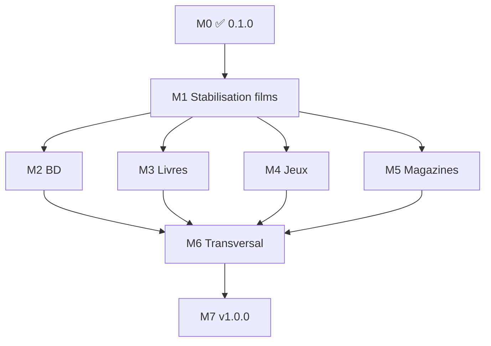

# Roadmap — Médiathèque

**Version actuelle : 0.2.1** (2026-05-31)  
**Documentation :** [doc/mediatheque.md](doc/mediatheque.md) · [CHANGELOG.md](CHANGELOG.md)

---

## Vision

Une **seule application** pour gérer films, BD/manga, livres, jeux vidéo et magazines, avec le **même parcours** (catalogue → collection → envies → notes) et un **changement de contexte global** via des **onglets colorés**.

**Principe :** un champ `media_domain` sur le catalogue (`oeuvres`) filtre données et écrans ; les spécificités de chaque média s’ajoutent par phases sans réécrire toute l’app.

---

## État des phases (suivi)

| Phase | Statut | Version cible | Résumé |
|-------|--------|---------------|--------|
| **M0** Fondations multi-médias | ✅ **Livré** (0.1.0) | 0.1.0 | Onglets, couleurs, `media_domain`, films filtrés |
| **M1** Stabilisation films | 🔄 **En cours** | 0.2.0 | QA complète, zéro régression Monciné |
| **M2** BD / Manga | ⏳ À faire | 0.3.x | Collection BD, séries/tomes |
| **M3** Livres | ⏳ À faire | 0.4.x | ISBN, auteur, import CSV |
| **M4** Jeux vidéo | ⏳ À faire | 0.5.x | Physique + plateformes |
| **M5** Magazines | 🔄 **En cours** | 0.2.x | Séries, numéros, PDF, recherche texte PDF, tags support (**0.2.1**) |
| **M6** Transversal | ⏳ À faire | 0.9.x | Prêts, partage, stats par domaine |
| **M7** Identité & polish | ⏳ À faire | 1.0.0 | Branding, doc finale, déploiement |

---

## Livré en 0.1.0 (phase M0)

### Données

- [x] Migration **`030_media_domain.sql`** — colonne `oeuvres.media_domain` (défaut `film`)
- [x] Index `idx_oeuvres_media_domain`
- [x] Schéma frais `sql/schema.sql` aligné
- [x] Règle foyer : **même foyer**, collections **séparées par domaine** (filtrage sur `oeuvres`)

### Code PHP

- [x] `MediaDomain` — constantes, couleurs, libellés navigation
- [x] `MediaContext` — domaine actif en session
- [x] `MediaDomainGuards` — page « bientôt », pages réservées aux films, URL après changement d’onglet
- [x] `CatalogSchema::applyMediaDomainFilter()` — filtre SQL central
- [x] Dépôts mis à jour : collection, catalogue admin, bibliothèque, envies groupe, partage, profil public

### Interface

- [x] Onglets `templates/_media_domain_tabs.php` + `www/set-media-domain.php`
- [x] Thème CSS par domaine (accent, barre, en-tête, fond)
- [x] Pastille couleur par onglet ; onglet actif mis en évidence
- [x] Libellés dynamiques (Mes films / Mes BD…)
- [x] « Ce soir » masqué hors onglet Films

### Qualité

- [x] Tests `MediaDomainTest` (unitaire + intégration)
- [x] Correctifs : quiz ↔ changement d’onglet, `$foyer` sur page compte
- [x] `.gitignore` données locales et graine volumineuse

### Palette couleurs (0.1.0)

| Domaine | Accent | Usage |
|---------|--------|--------|
| Films | `#adb5bd` (gris) | Dvdthèque — neutre |
| BD / Manga | `#f06292` (rose) | — |
| Livres | `#64b5f6` (bleu) | — |
| Jeux | `#9575cd` (violet) | — |
| Magazines | `#4db6ac` (vert d’eau) | — |

---

## Architecture cible

```text
┌─────────────────────────────────────────────────────────────┐
│  Onglets : Films │ BD │ Livres │ Jeux │ Magazines           │
│  (session + thème CSS --media-accent)                       │
└──────────────────────────┬──────────────────────────────────┘
                           │
     ┌─────────────────────┼─────────────────────┐
     ▼                     ▼                     ▼
  Catalogue            Ma collection          Mes envies
  (oeuvres)            (bibliotheque)       (wishlist)
     │                     │                     │
     └──────── media_domain = film | bd | … ────┘
                           │
     Foyers, comptes, amis, prêts, notifications… (commun)
```

### Identique d’un média à l’autre (objectif final)

Comptes, foyers, envies personnelles et de groupe, catalogue partagé, soumissions, historique / notes, recherche collection & catalogue, partage visiteur, prêts (physique), import/export, listes imprimables, affiches, EAN, notifications, maintenance SQLite.

### Spécifique par média

| Élément | Films | BD/Manga | Livres | Jeux | Magazines |
|---------|-------|----------|--------|------|-----------|
| Enrichissement | TMDB / OMDB | Manuel (+ API plus tard) | ISBN / Open Library | IGDB | — |
| Métadonnées clés | Réalisateur, acteurs | Série, tome, auteurs | Auteur, ISBN | Plateforme, éditeur | N°, parution |
| Support exemplaire | DVD, Blu-ray… | Album, relié… | Broché, poche… | Boîte, démat… | **PDF** |
| Outil dédié | Quiz « Ce soir » | — | — | — | Lecteur + recherche PDF |
| Sagas | Sagas films | Séries BD | Collections | Franchises | Titre de revue |

---

## Phase M1 — Stabilisation films (priorité actuelle)

**Objectif :** confirmer que l’onglet Films = Monciné 1.0.0 sans régression.

**Version visée :** `0.2.0`

### Checklist fonctionnelle

- [ ] **Collection** — liste, tri, recherche, filtres type (film/série/doc…)
- [ ] **Fiche film** — affichage, modification, notes, historique vision
- [ ] **Ajout / suppression** — collection et envies
- [ ] **Enrichissement** — TMDB, OMDB, affiches
- [ ] **Envies** — personnelles, cibles support/EAN, envies du groupe
- [ ] **Quiz & résultat** — tirage, exclusion, changement d’onglet OK
- [ ] **Sagas, personnes, support** — navigation et filtres
- [ ] **Statistiques** — compteurs, temps de vision
- [ ] **Import / export** — CSV bibliothèque et catalogue
- [ ] **Prêts** — demande, acceptation, retour
- [ ] **Partage visiteur** — liens collection / envies
- [ ] **Social** — amis, groupe, profil public
- [ ] **Admin** — catalogue, soumissions, maintenance, sauvegarde base
- [ ] **Compte** — profil, mot de passe, suppression compte
- [ ] **Inscription** — si activée

### Checklist technique

- [ ] Toutes les œuvres existantes ont `media_domain = film` (script de vérif post-migration)
- [ ] Soumissions catalogue : préciser `media_domain` dans le payload (défaut `film`)
- [ ] Import catalogue / bibliothèque : forcer ou lire colonne domaine
- [ ] Suite PHPUnit complète verte
- [ ] Mise à jour [doc/mediatheque.md](doc/mediatheque.md) après QA

**Critère de sortie M1 :** parcours ci-dessus validés manuellement + tests CI OK → tag `v0.2.0`.

---

## Phase M2 — BD / Manga

**Version visée :** `0.3.0`

| Tâche | Détail |
|-------|--------|
| Schéma | Table `oeuvre_bd` (ou équivalent) : série, tome, scénariste, dessinateur, éditeur, type manga/bd/comics |
| Formulaires | Ajout / édition œuvre BD ; masquer champs « réalisateur TMDB » |
| Collection | `findAll` / fiche / envies avec `media_domain = bd` |
| Séries | Réutiliser `saga` ou champ série dédié |
| Affiches | `PosterStorage` (évent. sous-dossier `posters/bd/`) |
| Import | CSV BD documenté (`doc/import-bd.md`) |
| Enrichissement | Optionnel : AniList / BNF (phase ultérieure) |

**Critère de sortie :** onglet BD utilisable sans API externe.

---

## Phase M3 — Livres

**Version visée :** `0.4.0`

| Tâche | Détail |
|-------|--------|
| Schéma | `oeuvre_livre` : auteur(s), ISBN, pages, éditeur, collection |
| Stockage | `MediaStorage::SUBDIR_BOOKS` pour pièces jointes futures |
| Formulaires & listes | Domaine `livre` |
| Import | `doc/import-livres.md` + colonnes CSV |

**Critère de sortie :** livres papier en collection (pas d’obligation ebook).

---

## Phase M4 — Jeux vidéo

**Version visée :** `0.5.0`

| Tâche | Détail |
|-------|--------|
| Schéma | `oeuvre_jeu` : studio, genre, plateforme (Steam, PSN…), mode physique/démat |
| Exemplaire | Boîte, édition ; flag « non prêtable » si démat |
| Listes | Plateformes configurables |

**Critère de sortie :** collection + envies jeux physiques et démat.

---

## Phase M5 — Magazines (PDF)

**Version livrée partiellement :** `0.2.0` → `0.2.1` · **Version visée complète :** `0.6.0`

| Tâche | Statut | Détail |
|-------|--------|--------|
| Modèle séries + numéros | ✅ 0.2.0 | `series`, `oeuvre_magazine`, sommaire |
| Upload PDF | ✅ 0.2.1 | `magazines/{revue}/{année}/…`, limites dev 350 Mo |
| Lecture PDF | ✅ | `media-object.php`, bouton sur fiche |
| Tags support papier / PDF | ✅ 0.2.1 | `MagazineSupport`, sync à l’import |
| Recherche série (n°, date, sommaire) | ✅ 0.2.1 | Paramètre `q` |
| Texte PDF (6 pages) | ✅ 0.2.1 | `pdftotext` → `pdf_text_preview` |
| Couverture / pages auto | ✅ 0.2.1 | `pdftoppm`, `pdfinfo` |
| Recherche FTS globale | ⏳ | Hors scope 0.2.1 |

**Doc :** [doc/magazines.md](doc/magazines.md) · **Infra :** `stored_objects`, `StoredObjectDelivery`, Poppler optionnel.

---

## Phase M6 — Fonctions transverses

**Version visée :** `0.9.0` — après au moins **deux** domaines en production.

| Module | Adaptation |
|--------|------------|
| Statistiques | Filtre domaine ; libellés « lu » / « joué » selon média |
| Prêts | Physique uniquement ; pas de prêt PDF/démat |
| Partage | Paramètre domaine dans le lien ; libellés |
| Import / export | Schéma CSV par domaine |
| Soumissions | Formulaire selon onglet actif |
| Listes imprimables | Colonnes par domaine |
| Notifications | Types par domaine |
| Profil public | Collection du domaine consulté |
| Maintenance | Stats et nettoyage PDF orphelins |

---

## Phase M7 — Identité & version 1.0.0

**Version visée :** `1.0.0` Médiathèque (multi-médias abouti)

| Tâche | Détail |
|-------|--------|
| Nom & logo | Affichage « Médiathèque » (déjà en 0.1.0) ; assets si besoin |
| Variables env | Alias `MEDIATHEQUE_*` optionnels, doc migration |
| Namespace PHP | Garder `Moncine\` sauf décision contraire (gros refactor) |
| Documentation | Guide par média dans `doc/` |
| Install seed | Exemples CSV/ZIP par domaine (optionnel) |
| Déploiement | Notes YunoHost / serveur classique |

---

## Décisions actées (M0)

| Sujet | Décision |
|-------|----------|
| Métadonnées spécifiques | **Tables filles** (`oeuvre_bd`, …) — pas de gros JSON |
| URL / onglet | **Session** + `set-media-domain.php` (pas de `/bd/` dans l’URL pour l’instant) |
| Foyer | **Une collection par domaine** dans le même foyer |
| Quiz | **Films uniquement** |
| Couleur Films | **Gris** (distinct des autres onglets) |
| Code Monciné | Namespace **`Moncine\`**, constantes **`MONCINE_*`**, **`moncine.db`** — **ne pas renommer avant M7** → [doc/conventions-techniques.md](doc/conventions-techniques.md) |

---

## Dépendances entre phases



**Parallèle possible après M1 :** M2, M3, M4. **M5** peut avancer en parallèle (peu de dépendances aux autres domaines).

---

## Risques & mitigations

| Risque | Mitigation |
|--------|------------|
| Régression dvdthèque | M1 checklist + PHPUnit |
| Multiplication `if (domaine)` | `MediaDomain`, `CatalogSchema`, guards |
| PDF lourds | Hors `www/`, limites upload, FTS optionnelle |
| APIs instables | Saisie manuelle d’abord |
| Confusion Monciné / Médiathèque | CHANGELOG, doc/mediatheque.md, version 0.1.0 |

---

## Estimation (indicative)

| Phase | Effort | Version |
|-------|--------|---------|
| M0 | ✅ fait | 0.1.0 |
| M1 | 1 semaine | 0.2.0 |
| M2 | 2 semaines | 0.3.0 |
| M3 | 1–2 semaines | 0.4.0 |
| M4 | 1–2 semaines | 0.5.0 |
| M5 | 3–4 semaines | 0.6.0 |
| M6 | 2–3 semaines | 0.9.0 |
| M7 | 1 semaine | 1.0.0 |

---

## Prochaine action (équipe / développement)

1. **Tagger** `v0.1.0` sur le dépôt.  
2. **Exécuter la checklist M1** (films) et corriger les anomalies.  
3. **Publier `0.2.0`** quand M1 est vert.  
4. **Choisir** le prochain domaine métier (souvent **M2 BD** ou **M5 magazines** selon priorité utilisateur).

---

## Références code

| Sujet | Fichiers |
|-------|----------|
| Domaine média | `lib/MediaDomain.php`, `lib/MediaContext.php`, `lib/MediaDomainGuards.php` |
| SQL | `sql/migrations/030_media_domain.sql` |
| Collection films | `lib/FilmRepository.php`, `lib/CatalogFilmRepository.php` |
| Sous-types films | `lib/MoncineContentKind.php` (film / série / spectacle) |
| PDF futur | `lib/MediaStorage.php`, `lib/StoredObjectRepository.php` |
| UI | `templates/_media_domain_tabs.php`, `templates/layout.php` |
| **Conventions dev** | [doc/conventions-techniques.md](doc/conventions-techniques.md) |

*Dernière mise à jour : 0.1.0 — 2026-05-30.*
