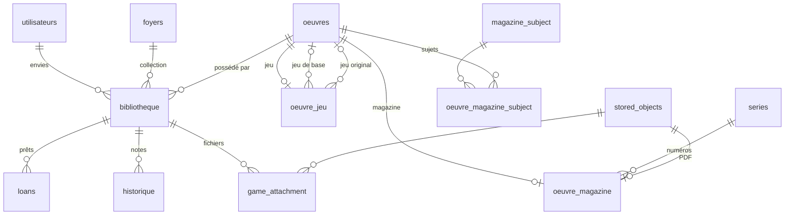

# Structure de la base de données — Médiathèque

**Version : 0.6.5** · **Moteur :** SQLite (`data/moncine.db`) · **Schéma de référence :** [`sql/schema.sql`](../sql/schema.sql)

Ce document décrit **comment la base est organisée** : quelles tables existent, à quoi elles servent, et comment elles sont reliées entre elles. Il complète la doc fonctionnelle par domaine ([jeux.md](jeux.md), [magazines.md](magazines.md)).

---

## Maintenance de ce document

**À mettre à jour à chaque changement de schéma SQL**, en même temps que :

1. le fichier de migration (`sql/migrations/NNN_*.sql`) ;
2. le schéma complet [`sql/schema.sql`](../sql/schema.sql) (installations neuves).

Checklist rapide :

| Action | Fichiers à toucher |
|--------|-------------------|
| Nouvelle colonne ou table | migration + `schema.sql` + **ce document** |
| Nouvelle version livrée | en-tête **Version** de ce fichier |
| Détail métier d’un domaine | doc du domaine (`jeux.md`, `magazines.md`, …) + résumé ici si la table change |

**Source de vérité technique :** `sql/schema.sql` pour une base vierge ; `schema_migrations` en base pour une installation existante.

Commande utile :

```bash
php lib/cli/migrate.php
```

---

## 1. Principes généraux

### Catalogue vs bibliothèque

L’application sépare deux notions :

| Niveau | Table(s) principales | Signification |
|--------|---------------------|---------------|
| **Catalogue** | `oeuvres` (+ tables filles) | Fiche **partagée** : titre, affiche, synopsis, métadonnées communes à tous les utilisateurs |
| **Bibliothèque** | `bibliotheque` | Ce **vous** possédez : exemplaire dans la collection du **foyer**, ou entrée dans **vos envies** |

- Une œuvre catalogue peut exister sans être dans une bibliothèque.
- Chaque ligne `bibliotheque` pointe vers une `oeuvre_id`.
- L’historique de visionnage / notes (`historique`) est rattaché à l’**entrée bibliothèque**, pas directement au catalogue.

### Domaine média (`media_domain`)

Colonne sur `oeuvres` (et `series` pour les revues) :

| Valeur | Table(s) fille(s) | État |
|--------|-------------------|------|
| `film` | — (champs dans `oeuvres`) | ✅ Utilisable |
| `jeu` | `oeuvre_jeu` | ✅ Utilisable |
| `magazine` | `oeuvre_magazine` → `series` | ✅ Utilisable |
| `bd`, `livre` | *(à venir)* | Onglets « bientôt » |

Classe PHP : `MediaDomain` · Filtre SQL : `CatalogSchema::applyMediaDomainFilter()`.

### Sous-type film (`moncine_kind`)

Uniquement pour `media_domain = 'film'` : distingue **film**, **série** TV et **spectacle**. Ne pas confondre avec l’onglet BD/Livres/Jeux (voir [conventions-techniques.md](conventions-techniques.md) §3).

---

## 2. Vue d’ensemble (schéma relationnel)



---

## 3. Tables par catégorie

### 3.1 Cœur catalogue et collection

#### `oeuvres` — catalogue partagé

Une ligne = une fiche catalogue (film, jeu, numéro de magazine, …).

| Colonne | Rôle |
|---------|------|
| `id` | Identifiant catalogue (affiches locales : `posters/{id}.jpg`) |
| `media_domain` | Type de média (`film`, `jeu`, `magazine`, …) |
| `titre`, `titre_original` | Titre affiché / titre original (ex. anglais IGDB pour les jeux) |
| `annee`, `poster_url`, `synopsis` | Métadonnées communes |
| `realisateur`, `acteur_*`, `duree_min`, `styles` | Spécifique **films** |
| `tmdb_*`, `omdb_*` | Enrichissement TMDB / OMDb |
| `moncine_kind` | Film vs série vs spectacle (domaine `film` uniquement) |
| `saga`, `saga_ordre` | **Films** : saga catalogue partagée et ordre dans la saga (migration **052**, **0.6.5**) |

Contrainte : `UNIQUE (titre, realisateur)` — pour les jeux, `realisateur` reste souvent vide.

#### `bibliotheque` — collection et envies

| Colonne | Rôle |
|---------|------|
| `oeuvre_id` | Lien vers le catalogue |
| `statut` | `collection` (foyer) ou `wishlist` (utilisateur) |
| `foyer_id` / `user_id` | Propriétaire selon le statut |
| `support_physique`, `format_image`, `format_son` | Exemplaire physique (films surtout) |
| `saga`, `saga_ordre` | Copie locale de la saga catalogue à l’ajout ; l’affichage et les pages `/sagas.php` utilisent `oeuvres.saga` en priorité (**0.6.5**) |
| `saison_numero`, `saison_label` | Saisons de séries TV |
| `ean` | Code-barres exemplaire |
| `tested_on_linux`, `linux_not_supported` | Jeux PC : compatibilité Linux (tri-état) |
| `non_pretable` | Exemplaire exclu des prêts entre amis (migration 049) |

#### `historique` — notes et dates

| Colonne | Rôle |
|---------|------|
| `film_id` | Référence **`bibliotheque.id`** (nom historique Monciné, valable aussi pour les jeux) |
| `user_id` | Utilisateur ayant noté |
| `date_vue`, `note` | Date et note |

---

### 3.2 Jeux vidéo

#### `oeuvre_jeu` — métadonnées catalogue (1 ligne par jeu)

Extension de `oeuvres` quand `media_domain = 'jeu'`. Clé primaire = `oeuvre_id`.

| Colonne | Migration | Rôle |
|---------|-----------|------|
| `studio`, `editeur`, `genre` | 039 | Développeur, éditeur, genres (liste séparée par virgules) |
| `platform`, `is_digital` | 039 | Plateforme principale, flag démat |
| `physical_supports`, `digital_stores` | 040 | Éditions physiques / magasins démat |
| `is_extension`, `base_game_oeuvre_id` | 044 | Extension (DLC) → jeu de base |
| `is_remake`, `original_game_oeuvre_id` | 045 | Remake → jeu original |
| `igdb_id`, `igdb_enriched_at` | 046 | Identifiant et date d’enrichissement IGDB |
| `franchise` | 047 | Saga IGDB (champ technique ; affiché « Saga » dans l’interface) |
| `game_mode`, `theme` | 047 | Modes et thèmes (traduits FR côté app) |
| `alternative_names` | 047 | Acronymes retenus (GTA, FF, …) |

Le **nom** de saga est sur `oeuvre_jeu.franchise` (catalogue, souvent IGDB). Le **classement** dans une saga se fait par **année de sortie**, puis titre. Page dédiée : `/sagas-jeux.php` — voir [jeux.md](jeux.md).

#### `game_attachment` — fichiers joints à la bibliothèque

Pièces jointes (manuels, sauvegardes…) liées à une entrée `bibliotheque`, via `stored_objects`.

---

### 3.3 Magazines

| Table | Rôle |
|-------|------|
| `series` | Revue (titre, éditeur, tags, affiche, dates de parution…) |
| `oeuvre_magazine` | Numéro : `series_id`, `numero`, date, sommaire, PDF (`stored_object_id`) |
| `series_bibliotheque` | Série suivie en collection ou envies (niveau **série**, pas numéro) |
| `magazine_subject` | Sujet normalisé (test, preview, interview…) |
| `oeuvre_magazine_subject` | Lien N↔N numéro ↔ sujet |
| `magazine_subject.catalog_oeuvre_id` | Lien optionnel vers un **jeu** catalogue (pont magazine ↔ jeux) — voir [pont-magazine-jeu.md](pont-magazine-jeu.md) |

Recherche plein texte (FTS) : migration **038** — voir [magazines.md](magazines.md).

---

### 3.4 Comptes, foyers et social

| Table | Rôle |
|-------|------|
| `utilisateurs` | Comptes, rôles (`admin` / `user`), profil |
| `foyers` | Groupes familiaux / amis |
| `group_members`, `group_invitations` | Appartenance et invitations au foyer |
| `friendships` | Relations entre utilisateurs |
| `password_reset_tokens` | Réinitialisation mot de passe |
| `inscription_requests` | Inscriptions en attente (email + validation admin) |
| `email_change_requests` | Changement d’adresse email |

---

### 3.5 Catalogue collaboratif et notifications

| Table | Rôle |
|-------|------|
| `catalogue_soumissions` | Propositions d’ajout au catalogue (JSON + modération) |
| `catalog_admin_audit` | Journal des actions admin sur le catalogue |
| `notifications` | Notifications in-app |
| `oeuvre_eans` | Codes EAN catalogue par support |
| `wishlist_targets` | Cible précise d’une envie (support, EAN) |

---

### 3.6 Prêts et partage

| Table | Rôle |
|-------|------|
| `loans` | Prêt en cours ou terminé |
| `loan_requests` | Demande de prêt entre amis |
| `share_links` | Lien de partage lecture seule (collection ou envies) |

---

### 3.7 Fichiers stockés

| Table | Rôle |
|-------|------|
| `stored_objects` | Métadonnées fichier (chemin relatif sous `MONCINE_MEDIA_PATH`, MIME, taille) |

Contenu binaire **hors** base SQLite (dossier média configuré).

---

### 3.8 Legacy

#### `films`

Ancienne table Monciné (dvdthèque autonome, avant le modèle catalogue `oeuvres` + `bibliotheque`). Conservée pour compatibilité ; les nouvelles installations s’appuient sur `oeuvres`.

---

### 3.9 Tables techniques

| Table | Rôle |
|-------|------|
| `app_metadata` | Paires clé/valeur (édition paquet, numéro de schéma, réglages app) |
| `schema_migrations` | Nom de chaque migration SQL déjà appliquée |

Créées / gérées par `lib/SchemaMigrator.php`.

---

## 4. Index et contraintes notables

- **Collection foyer :** une seule entrée `collection` par couple `(foyer_id, oeuvre_id)`.
- **Envies utilisateur :** une seule wishlist par couple `(user_id, oeuvre_id)`.
- **EAN catalogue :** un code EAN ne peut être attaché qu’à une seule œuvre.
- **Jeux :** index sur `platform`, `studio`, `genre`, extensions et remakes.

Liste complète : voir [`sql/schema.sql`](../sql/schema.sql).

---

## 5. Migrations

| Élément | Emplacement |
|---------|-------------|
| Fichiers numérotés | `sql/migrations/` (`001` … `047` en **0.5.6**) |
| Schéma initial | `sql/schema.sql` (créé au premier lancement si la base n’existe pas) |
| Application | Automatique au démarrage ou `php lib/cli/migrate.php` |

### Migrations jeux (historique récent)

| N° | Fichier | Contenu |
|----|---------|---------|
| 039 | `039_oeuvre_jeu_magazine_link.sql` | Création `oeuvre_jeu`, pont magazine |
| 040 | `040_oeuvre_jeu_editions.sql` | Supports physiques et magasins démat |
| 041 | `041_bibliotheque_tested_on_linux.sql` | Flag Linux bibliothèque |
| 042 | `042_game_attachment.sql` | Pièces jointes jeux |
| 043 | `043_bibliotheque_linux_not_supported.sql` | Tri-état Linux |
| 044 | `044_oeuvre_jeu_extensions.sql` | Extensions / DLC |
| 045 | `045_oeuvre_jeu_remakes.sql` | Remakes |
| 046 | `046_oeuvre_jeu_igdb.sql` | IGDB id + date enrichissement |
| 047 | `047_oeuvre_jeu_igdb_metadata.sql` | Franchise, modes, thèmes, acronymes |
| 049 | `049_bibliotheque_non_pretable.sql` | Exemplaire non prêtable (prêts jeux) |
| 050 | `050_game_platform.sql` | Table `game_platform` |
| 051 | `051_oeuvre_jeu_multi_platform.sql` | Plateformes catalogue et bibliothèque |
| 052 | `052_oeuvres_saga.sql` | Sagas films sur `oeuvres` (catalogue partagé) |
| 053 | `053_game_platform_snes.sql` | Plateforme Super Nintendo (`snes`) |

Migration transversale multi-médias : **030** (`media_domain` sur `oeuvres`).

---

## 6. Conventions développeur

Lors d’un **nouveau domaine média** (ex. BD) :

1. Ajouter une table fille `oeuvre_*` (pas de gros JSON opaque).
2. Renseigner `oeuvres.media_domain` à chaque insertion.
3. Réutiliser `bibliotheque` pour collection / envies.
4. Mettre à jour **`sql/schema.sql`**, la migration, et **ce document**.

Détails : [conventions-techniques.md](conventions-techniques.md) §4.

---

## 7. Documentation par domaine

| Domaine | Doc fonctionnelle |
|---------|-------------------|
| Jeux | [jeux.md](jeux.md) |
| Magazines | [magazines.md](magazines.md) |
| Fork / multi-médias | [mediatheque.md](mediatheque.md) |
| Nommage code | [conventions-techniques.md](conventions-techniques.md) |

---

*Dernière mise à jour : **0.6.8** (2026-06-30) — propositions jeux catalogue, plateforme SNES.*
