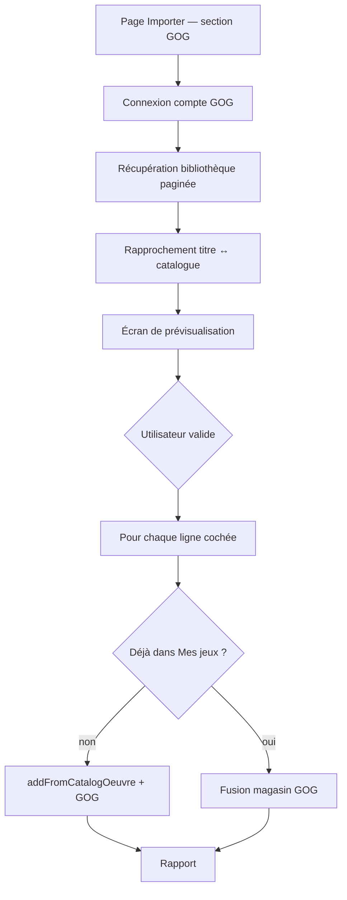

# Import bibliothèque GOG (spécification — à implémenter)

**Statut :** 📋 **Notice / cahier des charges** — fonctionnalité **non développée**  
**Version cible (indicatif) :** 0.6.x ou ultérieur (polish M4)  
**Date de rédaction :** 2026-06-16

---

## Objectif

Permettre à un utilisateur connecté à son compte **GOG** de synchroniser sa **bibliothèque de jeux possédés** vers **Mes jeux** dans Médiathèque, **sans créer de nouvelles fiches catalogue**.

Principe retenu :

- seuls les jeux **déjà présents dans le catalogue partagé** (`oeuvres` + `oeuvre_jeu`) peuvent être traités ;
- l’utilisateur **valide** les correspondances douteuses avant import ;
- si un jeu est **déjà en collection** (ex. version Steam ou boîte physique), on **ajoute quand même** le magasin **GOG** sur la fiche (icône + lien), sans dupliquer l’entrée bibliothèque.

Référence API (non officielle) : [GOG API Documentation](https://gogapidocs.readthedocs.io/en/latest/).

---

## Périmètre

### Inclus

| Élément | Détail |
|---------|--------|
| Connexion OAuth GOG | Flux navigateur + token + refresh (voir doc GOG) |
| Liste des jeux possédés | Endpoints `embed.gog.com` (filtrer `isGame`) |
| Rapprochement catalogue | `GameRepository::searchCatalog()` + `SearchMatch` |
| Écran de prévisualisation | Cases à cocher, choix manuel si ambiguïté |
| Ajout collection | `GameRepository::addFromCatalogOeuvre()` si absent de la bibliothèque |
| Tag GOG | Fusion dans `oeuvre_jeu.digital_stores` si déjà en bibliothèque |
| Rapport final | X ajoutés, Y enrichis (GOG), Z ignorés, W absents du catalogue |

### Exclus (v1)

| Élément | Raison |
|---------|--------|
| Création de fiches catalogue | Catalogue = admin / enrichissement IGDB / saisie manuelle |
| Import des **films** GOG | Hors périmètre jeux |
| Import liste d’**envies** GOG | Extension possible plus tard (`/user/wishlist.json`) |
| Synchronisation automatique planifiée | v1 = action manuelle depuis **Importer** |
| Stockage permanent du token GOG côté serveur | À trancher (session vs chiffrement) — voir § Sécurité |

---

## Flux utilisateur



### Étapes détaillées

1. **Importer** (`/import.php`) — nouvelle section « Importer depuis GOG » (onglet Jeux).
2. **Connexion** — redirection `auth.gog.com` ; récupération `code` → `access_token` + `refresh_token`.
3. **Téléchargement** — `GET /account/getFilteredProducts` (paginé, `mediaType` = jeux) ; ignorer `isMovie`.
4. **Matching** — pour chaque titre GOG, recherche catalogue ; classer en trois niveaux :
   - **Auto** : un seul candidat, score élevé (`SearchMatch`) ;
   - **À confirmer** : plusieurs candidats ou score moyen → l’utilisateur choisit ou ignore ;
   - **Absent** : aucun candidat → ligne grisée, non importable.
5. **Validation** — l’utilisateur coche les lignes à traiter (auto cochées, ambiguës décochées par défaut).
6. **Application** — voir § Comportement bibliothèque.
7. **Rapport** — message récapitulatif + lien vers Mes jeux.

---

## Rapprochement catalogue

### Données GOG utiles

| Champ GOG | Usage |
|-----------|--------|
| `id` | Identifiant produit (traçabilité ; optionnel en v1) |
| `title` | Recherche `searchCatalog()` |
| `slug` | URL `https://www.gog.com/game/{slug}` |
| `isGame` | Filtrer les films |
| `releaseDate` | Affiner le choix si plusieurs candidats |
| `worksOn.Linux` | Info affichée à l’utilisateur (pas d’écriture auto Linux en v1) |

### Règles de confiance (proposition)

| Niveau | Condition | UI |
|--------|-----------|-----|
| **Fort** | 1 candidat, score `SearchMatch` ≥ seuil à définir | Pré-coché |
| **Moyen** | 1 candidat score moyen, ou 2–3 candidats proches | Décoché ; liste de choix |
| **Faible / aucun** | 0 candidat ou homonymes trop éloignés | Ignoré ou choix manuel obligatoire |

Ne **jamais** importer automatiquement une ligne « moyenne » sans action utilisateur.

### Cas particuliers

- **DLC / éditions GOG** listés comme produits séparés : souvent **sans** équivalent catalogue → ignorés (normal).
- **Titres GOG** avec ordre des mots différent (« The Witcher 3 » vs « Witcher 3: Wild Hunt, The ») : `SearchMatch` + année.
- **Bundles** : traiter comme un produit ; match souvent impossible → ignoré.

---

## Comportement bibliothèque

### Jeu pas encore dans Mes jeux

Appeler `GameRepository::addFromCatalogOeuvre($oeuvreId, COLLECTION, $userId, $foyerId, $details)` avec :

```php
$details = [
    'platform' => 'pc',  // GamePlatform::PC
    'is_digital' => true,
    'digital_stores' => GameDigitalStore::serializeList([
        ['store' => 'gog', 'url' => 'https://www.gog.com/game/{slug}'],
    ]),
    // physical_supports : ne pas écraser si déjà renseigné sur la fiche
];
```

### Jeu déjà dans Mes jeux (Steam, physique, autre démat)

- **Ne pas** rappeler `addFromCatalogOeuvre` (message « déjà dans la collection »).
- **Fusionner** le magasin GOG dans `oeuvre_jeu.digital_stores` :
  1. lire le JSON actuel (`GameDigitalStore::parseStoredList`) ;
  2. si `gog` absent, ajouter `{ store: 'gog', url: '...' }` ;
  3. conserver Steam / Epic / supports physiques existants ;
  4. `is_digital = 1` si au moins un magasin démat.
- Résultat attendu : icône GOG visible (`GameEditionIcons`) en plus de Steam / CD, etc.

> **Note modèle de données :** `digital_stores` et `physical_supports` sont sur **`oeuvre_jeu`** (fiche catalogue), pas sur `bibliotheque`. C’est le comportement actuel des formulaires d’ajout jeu. Les flags **Linux** restent sur `bibliotheque` (`tested_on_linux`, `linux_not_supported`).

### Fonction à prévoir

```php
// Exemple de signature (à implémenter)
GameDigitalStore::mergeStore(string $existingJson, string $store, string $url = ''): string
```

Ou méthode dédiée dans `GameRepository::appendDigitalStoreForOeuvre(int $oeuvreId, string $store, string $url): void`.

---

## API GOG (rappel technique)

Documentation : [Authentication](https://gogapidocs.readthedocs.io/en/latest/auth.html), [Account — Games](https://gogapidocs.readthedocs.io/en/latest/account.html), [Listing](https://gogapidocs.readthedocs.io/en/latest/listing.html).

| Étape | Endpoint |
|-------|----------|
| Login | `GET https://auth.gog.com/auth` (navigateur) |
| Token | `GET https://auth.gog.com/token` |
| IDs possédés | `GET https://embed.gog.com/user/data/games` |
| Liste détaillée | `GET https://embed.gog.com/account/getFilteredProducts` |
| Détail jeu | `GET https://embed.gog.com/account/gameDetails/{id}.json` |

En-tête : `Authorization: Bearer {access_token}`.

**Limites connues :**

- API **non officielle** (reverse-engineering client Galaxy / site) — peut casser sans préavis.
- CAPTCHA possible à la connexion.
- Token ~1 h ; prévoir `refresh_token`.
- Conditions d’utilisation GOG à vérifier avant mise en production.

---

## Intégration Médiathèque (fichiers prévus)

| Zone | Fichiers / classes (indicatif) |
|------|--------------------------------|
| Config | `GogConfig` — tokens en session ou `data/gog_credentials.json` chiffré (à décider) |
| Client HTTP | `GogClient` — auth, refresh, `getOwnedGames()`, `getFilteredProducts()` |
| Import | `GogLibraryImporter` — matching, preview DTO, apply |
| UI | Section dans `templates/import.php` ; page ou panneau `_gog_import_panel.php` |
| Handlers | `www/connecter-gog.php`, `www/importer-gog.php` (POST validation) |
| Tests | `GogLibraryImporterTest`, `GameDigitalStoreTest::testMergeStore` |

### Réutilisation existante

| Besoin | Existant |
|--------|----------|
| Recherche catalogue | `GameRepository::searchCatalog()`, `SearchMatch`, `GameTitle` |
| Ajout bibliothèque | `GameRepository::addFromCatalogOeuvre()` |
| Magasins démat | `GameDigitalStore` (`gog`, `steam`, `epic`) |
| Déjà en collection ? | `GameRepository::findLibraryBibIdForCatalogOeuvre()` |
| Page d’entrée | `/import.php` (comme enrichissement IGDB) |

---

## Sécurité et confidentialité

- Ne jamais logger les `access_token` / `refresh_token`.
- Stocker les tokens de façon **chiffrée** ou en **session** uniquement (durée limitée).
- CSRF sur toutes les actions POST (`Csrf::rejectUnlessValid`).
- L’import ne modifie que la bibliothèque du **foyer / utilisateur** connecté ; la fusion `digital_stores` touche la fiche **catalogue** partagée — documenter pour l’utilisateur si plusieurs foyers partagent le même catalogue admin.

---

## Évolutions ultérieures (hors v1)

- Colonne ou table `gog_product_id` ↔ `oeuvre_id` pour resync fiable.
- Import **envies** GOG → `LibraryStatut::WISHLIST`.
- Proposition Steam / Epic sur le même modèle.
- Mise à jour **Linux** si `worksOn.Linux` sur GOG (avec confirmation).
- Export inverse (lecture seule) — peu probable.

---

## Critères d’acceptation (tests manuels)

1. Jeu GOG présent au catalogue, absent de Mes jeux → ajouté avec icône GOG.
2. Jeu déjà en Mes jeux (Steam seul) → pas de doublon ; icône GOG ajoutée.
3. Jeu déjà en Mes jeux (GOG déjà présent) → aucun changement / message « déjà GOG ».
4. Jeu absent du catalogue → ignoré, mentionné dans le rapport.
5. Deux candidats catalogue → utilisateur doit choisir ; rien n’est importé sans choix.
6. Film GOG → ignoré.
7. Déconnexion / token expiré → message clair, pas d’état corrompu.

---

## Liens

- [doc/jeux.md](jeux.md) — module jeux, `digital_stores`, enrichissement IGDB
- [ROADMAP.md](../ROADMAP.md) § M4 — polish jeux
- [doc/conventions-techniques.md](conventions-techniques.md) — nommage code

*Dernière mise à jour : 2026-06-16 — notice initiale, implémentation à planifier.*
