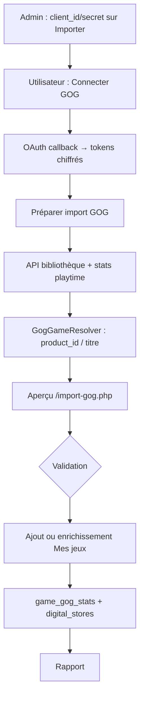

# Import bibliothèque GOG

**Statut :** 📋 **Cahier des charges — non implémenté**  
**Version cible (indicatif) :** 0.7.14+ (polish M4 jeux)  
**Dernière mise à jour :** 2026-07-07

> **Blocage actuel :** compte développeur GOG requis pour l’**approche A** (OAuth avec `redirect_uri` sur le site). Ce document sert de référence pour l’implémentation ultérieure.

---

## Objectif

Permettre à un utilisateur connecté à son compte **GOG** de synchroniser sa **bibliothèque de jeux possédés** et son **temps de jeu** (partiel) vers **Mes jeux**, sur le modèle de l’import Steam (`doc/import-steam.md`).

Principes retenus :

- seuls les jeux **déjà présents dans le catalogue partagé** (`oeuvres` + `oeuvre_jeu`) sont importables en v1 ;
- le lien fiable catalogue ↔ GOG repose sur **`oeuvre_jeu.gog_product_id`** (comme `steam_appid` pour Steam) — **c’est le travail de construction du catalogue** de renseigner cet identifiant ;
- l’utilisateur **valide** les correspondances douteuses avant import ;
- si un jeu est **déjà en collection** (Steam, physique, autre démat), on **fusionne** le magasin GOG (`digital_stores`) sans dupliquer l’entrée bibliothèque ;
- le **temps de jeu GOG** est importé mais peut être incomplet (jeux lancés hors Galaxy) ; la **saisie manuelle** reste disponible pour compléter ;
- le **total affiché** devient : **Steam + GOG + manuel** (extension de `GamePlaytime`).

Références API :

- [GOG API Documentation (communauté)](https://gogapidocs.readthedocs.io/en/latest/)
- Endpoints `api.gog.com` documentés ci-dessous (utilisés par des clients open-source type Heroic Games Launcher)

---

## Comparaison avec Steam (référence implémentée)

| Aspect | Steam (actuel) | GOG (prévu) |
|--------|----------------|-------------|
| Auth admin | Clé API globale (`SteamConfig`) | `client_id` + `client_secret` GOG (`GogConfig`) |
| Auth utilisateur | SteamID64 dans Paramètres | OAuth navigateur + tokens par utilisateur |
| ID catalogue | `oeuvre_jeu.steam_appid` | `oeuvre_jeu.gog_product_id` |
| Liens manuels import | `game_steam_appid_map` | `game_gog_product_map` |
| Stats playtime | `game_steam_stats` | `game_gog_stats` |
| Création fiches catalogue | Oui (admin / IGDB) | **Non en v1** — catalogue existant uniquement |
| API | Officielle Steam Web | Partiellement documentée ; OAuth approche A recommandée |

---

## Prérequis (avant de coder)

### 1. Compte développeur GOG — approche A (retenue)

Créer une application sur le portail développeur GOG et enregistrer :

| Paramètre | Valeur |
|-----------|--------|
| Authorization endpoint | `https://auth.gog.com/oauth2/authorize` ou `https://auth.gog.com/auth` |
| Token endpoint | `https://auth.gog.com/token` |
| Refresh | `POST https://auth.gog.com/token` (`grant_type=refresh_token`) |
| Scope | `gamelist` |
| Redirect URI | `{APP_URL}/gog-callback.php` (URL absolue du site Médiathèque) |

Stockage des identifiants app (admin), sur le modèle IGDB :

- variables d’environnement `MONCINE_GOG_CLIENT_ID` / `MONCINE_GOG_CLIENT_SECRET`
- ou fichier `data/gog_credentials.json` (chmod 0600)

### 2. Approche B — non retenue pour Médiathèque

Les identifiants du client **Galaxy** (`client_id` public, `redirect_uri = https://embed.gog.com/on_login_success?origin=client`) conviennent aux applications **bureau** (Heroic, lgogdownloader), pas à une app web dont le callback doit revenir sur **votre domaine**. Ne pas utiliser pour Médiathèque.

### 3. Migration base

Appliquer `sql/migrations/062_gog_import.sql` (à créer — voir § Schéma).

---

## Périmètre v1

### Inclus

| Élément | Détail |
|---------|--------|
| Connexion OAuth GOG (approche A) | Flux navigateur, `access_token` + `refresh_token`, refresh auto |
| Bibliothèque possédée | `GET https://api.gog.com/users/me/games` (paginé) |
| Temps de jeu | `GET https://api.gog.com/v2/users/me/stats?stat=playtime` (batch) |
| Rapprochement catalogue | Priorité `gog_product_id` → map manuelle → URL → titre |
| Écran de prévisualisation | Cases à cocher, choix manuel si ambiguïté |
| Ajout / enrichissement Mes jeux | `addFromCatalogOeuvre` ou fusion `digital_stores` |
| Icône GOG cliquable | Lien magasin (URL stockée ou repli `slug` / `product_id`) |
| Temps total affiché | Steam + GOG + saisie manuelle |
| Rapport final | X ajoutés, Y enrichis, Z ignorés, W absents catalogue |

### Exclus (v1)

| Élément | Raison |
|---------|--------|
| Création automatique de fiches catalogue | Catalogue = admin ; aligné spec initiale M4 |
| Import films GOG | Hors périmètre jeux |
| Import envies GOG | Extension ultérieure |
| Sync automatique planifiée (cron) | Import manuel comme Steam v1 |
| Mapping IGDB source GOG | Option ultérieure ; v1 = `gog_product_id` catalogue |

---

## Schéma base de données (migration `062_gog_import.sql`)

Sur le modèle de `058_steam_import.sql` et `059_steam_appid_map.sql` :

```sql
-- Identifiant produit GOG sur la fiche catalogue (renseigné par l’admin)
ALTER TABLE oeuvre_jeu ADD COLUMN gog_product_id INTEGER NOT NULL DEFAULT 0;

CREATE UNIQUE INDEX IF NOT EXISTS idx_oeuvre_jeu_gog_product_id
    ON oeuvre_jeu(gog_product_id) WHERE gog_product_id > 0;

-- Correspondance manuelle product_id → œuvre (persistante entre imports)
CREATE TABLE IF NOT EXISTS game_gog_product_map (
    gog_product_id INTEGER PRIMARY KEY,
    oeuvre_id INTEGER NOT NULL REFERENCES oeuvres(id) ON DELETE CASCADE,
    mapped_by_user_id INTEGER NOT NULL DEFAULT 0,
    source TEXT NOT NULL DEFAULT 'manual',
    mapped_at TEXT NOT NULL DEFAULT (datetime('now'))
);

CREATE INDEX IF NOT EXISTS idx_game_gog_product_map_oeuvre
    ON game_gog_product_map(oeuvre_id) WHERE oeuvre_id > 0;

-- Temps de jeu GOG synchronisé (par entrée bibliothèque)
CREATE TABLE IF NOT EXISTS game_gog_stats (
    bibliotheque_id INTEGER PRIMARY KEY REFERENCES bibliotheque(id) ON DELETE CASCADE,
    gog_product_id INTEGER NOT NULL DEFAULT 0,
    playtime_minutes INTEGER NOT NULL DEFAULT 0,
    last_played_unix INTEGER NOT NULL DEFAULT 0,
    synced_at TEXT NOT NULL DEFAULT (datetime('now'))
);

CREATE INDEX IF NOT EXISTS idx_game_gog_stats_product
    ON game_gog_stats(gog_product_id) WHERE gog_product_id > 0;

-- Tokens OAuth GOG par utilisateur (chiffrés — pas de colonne sur utilisateurs)
CREATE TABLE IF NOT EXISTS user_gog_tokens (
    user_id INTEGER PRIMARY KEY REFERENCES utilisateurs(id) ON DELETE CASCADE,
    gog_user_id TEXT NOT NULL DEFAULT '',
    username TEXT NOT NULL DEFAULT '',
    access_token_enc TEXT NOT NULL DEFAULT '',
    refresh_token_enc TEXT NOT NULL DEFAULT '',
    expires_at TEXT NOT NULL DEFAULT '',
    connected_at TEXT NOT NULL DEFAULT (datetime('now')),
    updated_at TEXT NOT NULL DEFAULT (datetime('now'))
);
```

Mettre à jour `lib/GameSchema.php` : `hasGogProductIdColumn()`, `gogStatsTableExists()`, `gogProductMapTableExists()`, `userGogTokensTableExists()`.

---

## API GOG — endpoints retenus

### Authentification

```
GET  https://auth.gog.com/auth?client_id=...&redirect_uri=...&response_type=code&layout=client2
POST https://auth.gog.com/token
     grant_type=authorization_code | refresh_token
     code=... | refresh_token=...
     client_id=... & client_secret=... & redirect_uri=...
```

Réponse token typique :

```json
{
  "access_token": "...",
  "expires_in": 3600,
  "refresh_token": "...",
  "token_type": "Bearer",
  "scope": "gamelist",
  "user_id": "46988961654682898"
}
```

### Utilisateur courant

```
GET https://api.gog.com/users/me
Authorization: Bearer {access_token}
```

### Bibliothèque (paginée)

```
GET https://api.gog.com/users/me/games?page=1&limit=50
Authorization: Bearer {access_token}
```

Réponse (extrait) :

```json
{
  "owned": [
    {
      "product_id": 1207658930,
      "title": "Cyberpunk 2077",
      "slug": "cyberpunk_2077",
      "platform_flags": { "windows": true, "mac": false, "linux": false },
      "image": "//images-1.gog.com/...",
      "dlcs": [1207658931],
      "is_hidden": false,
      "is_secret": false,
      "added_at": 1607584200
    }
  ],
  "total_count": 342,
  "page": 1,
  "limit": 50
}
```

Boucle `do…while` jusqu’à `count($all) >= total_count`. Filtrer films / contenus non-jeux selon champs disponibles.

### Temps de jeu (batch — préféré)

```
GET https://api.gog.com/v2/users/me/stats?stat=playtime
Authorization: Bearer {access_token}
```

```json
{
  "stats": [
    {
      "gameId": 1207658930,
      "stat": "playtime",
      "value": 45231,
      "unit": "seconds",
      "lastPlayed": "2024-05-01T12:34:56Z"
    }
  ]
}
```

- `value` est en **secondes** → convertir en minutes (`intdiv($seconds, 60)`).
- `value: 0` et `lastPlayed: null` = normal (jamais lancé via client compatible Galaxy).

### Métadonnées produit (public, sans auth)

```
GET https://api.gog.com/products/{product_id}
```

Utile pour enrichir titre / image si la bibliothèque est incomplète. Throttle ~1 req/s recommandé.

### URLs magasin

| Cas | URL |
|-----|-----|
| Avec `slug` | `https://www.gog.com/game/{slug}` |
| URL dans `digital_stores` | Conserver telle quelle |
| Images protocol-relative | Préfixer `https:` sur `//images-...` |

---

## Flux utilisateur



### Étapes détaillées

1. **Admin** — enregistre `client_id` / `client_secret` sur `/import.php` (section GOG).
2. **Utilisateur** — « Connecter mon compte GOG » → `/gog-connect.php` → login GOG → `/gog-callback.php`.
3. **Préparer l’import** — téléchargement bibliothèque + batch playtime → session preview (TTL 1 h, comme Steam).
4. **Aperçu** — `/import-gog.php` : lignes pré-cochées si match `gog_product_id` ou map manuelle ; décochées si ambiguïté.
5. **Validation** — POST `/import-gog-actions.php` (CSRF).
6. **Rapport** — ajoutés / enrichis / ignorés / absents catalogue.

---

## Rapprochement catalogue

### Priorité (miroir `SteamGameResolver`)

1. **`game_gog_product_map`** — lien manuel enregistré lors d’un import précédent
2. **`oeuvre_jeu.gog_product_id`** — renseigné à la construction du catalogue (admin)
3. **URL GOG** déjà présente dans `digital_stores`
4. **Titre** — bibliothèque utilisateur, puis catalogue (`SearchMatch` / clés pliées)

### Rôle de l’admin catalogue

L’import **ne crée pas** de fiches catalogue en v1. Pour qu’un jeu GOG soit importable :

1. Créer ou identifier la fiche `oeuvre_jeu` au catalogue.
2. Renseigner **`gog_product_id`** (champ à ajouter au formulaire d’édition fiche jeu catalogue, ex. `_oeuvre_jeu_edit_form.php`).
3. L’import matchera automatiquement par `product_id`.

Les liens manuels à l’import (`game_gog_product_map`) servent de filet pour les cas où le catalogue n’a pas encore l’ID mais l’utilisateur associe une fois.

### Cas particuliers

- **DLC / bundles** listés comme produits séparés : souvent sans `gog_product_id` catalogue → ignorés (normal).
- **Titres différents** GOG vs catalogue : repli titre ; sinon choix manuel à l’import.
- **Jeux à 0 min** : ne pas filtrer (comme Steam).

---

## Comportement bibliothèque

### Jeu pas encore dans Mes jeux

```php
$details = [
    'platform' => GamePlatform::PC,
    'is_digital' => true,
    'digital_stores' => GameDigitalStore::serializeList([
        ['store' => GameDigitalStore::GOG, 'url' => GogWebApiClient::storeUrl($productId, $slug)],
    ]),
];
GameRepository::addFromCatalogOeuvre($oeuvreId, LibraryStatut::COLLECTION, $userId, $foyerId, $details);
GameGogStatsRepository::upsert($bibId, $productId, $playtimeMinutes, $lastPlayedUnix);
GameRepository::setGogProductIdIfEmpty($oeuvreId, $productId);
```

### Jeu déjà dans Mes jeux (Steam, physique, autre démat)

- **Ne pas** dupliquer l’entrée `bibliotheque`.
- **Fusionner** GOG : `GameRepository::mergeDigitalStoreForOeuvre($oeuvreId, GameDigitalStore::GOG, $url)` — utilise déjà `GameDigitalStore::mergeStore()` en interne.
- **Mettre à jour** `game_gog_stats` pour cette entrée bibliothèque.

### Temps de jeu affiché

Étendre `lib/GamePlaytime.php` :

```
total_minutes = steam_playtime_minutes + gog_playtime_minutes + manual_playtime_minutes
```

Fichiers à adapter : `GamePlaytime`, `GameLibraryQuery` (JOIN `game_gog_stats`), `GameCollectionStats` (optionnel : cumul GOG seul), templates listes / fiche jeu.

La saisie manuelle sur la fiche jeu **complète** les imports ; elle n’est pas remplacée.

---

## Icône GOG cliquable

Aujourd’hui `GameEditionIcons::linkUrlForKey()` a un **repli Steam** via `steam_appid` si l’URL est vide ; **pas encore pour GOG**.

À implémenter pour `GameEditionIcons::GOG` :

1. URL dans `digital_stores` (priorité)
2. Sinon `https://www.gog.com/game/{slug}` si `slug` connu (ligne import ou catalogue)
3. Sinon repli via `gog_product_id` / `library_gog_product_id` (helper `GogWebApiClient::storeUrl()`)

Tests : étendre `tests/Unit/GameEditionIconsLinkTest.php`.

---

## Architecture code (fichiers à créer)

### Configuration et auth

| Fichier | Rôle |
|---------|------|
| `lib/GogConfig.php` | Credentials app (env / fichier), `redirectUri()` |
| `lib/GogAuthClient.php` | OAuth authorize, exchange, refresh, `users/me` |
| `lib/UserGogTokenRepository.php` | Stockage tokens chiffrés par `user_id` |

### Client API et import

| Fichier | Rôle |
|---------|------|
| `lib/GogWebApiClient.php` | Bibliothèque paginée, stats playtime, URLs, images |
| `lib/GogGameResolver.php` | Rapprochement product_id ↔ catalogue / bibliothèque |
| `lib/GogProductIdMapRepository.php` | Miroir `GameSteamAppIdMapRepository` |
| `lib/GameGogStatsRepository.php` | Miroir `GameSteamStatsRepository` |
| `lib/GogLibraryImporter.php` | Miroir `SteamLibraryImporter` (preview, apply, session) |

### Web

| Fichier | Rôle |
|---------|------|
| `www/gog-connect.php` | Redirect OAuth + `state` en session |
| `www/gog-callback.php` | Échange code, sauve tokens, redirect import |
| `www/gog-disconnect.php` | Suppression liaison compte |
| `www/import-gog-actions.php` | prepare / apply / map manuel |
| `www/import-gog.php` | Page aperçu |
| `templates/import-gog.php` | Tableau preview |
| `templates/import.php` | Section GOG (config + connexion + boutons) |

### Catalogue et maintenance

| Fichier | Rôle |
|---------|------|
| `templates/_oeuvre_jeu_edit_form.php` | Champ `gog_product_id` (admin) |
| `lib/GameRepository.php` | `setGogProductId`, `findCatalogByGogProductId`, etc. |
| `lib/CatalogMaintenance.php` | Fusion `gog_product_id` + migration `game_gog_product_map` |
| `lib/GameCatalogSql.php` | Exposer `gog_product_id` dans les requêtes catalogue |

### Réutilisation existante (déjà en place)

| Besoin | Existant |
|--------|----------|
| Fusion magasin démat | `GameDigitalStore::mergeStore()`, `GameRepository::mergeDigitalStoreForOeuvre()` |
| Icône GOG (affichage) | `GameEditionIcons`, `www/assets/img/game-editions/gog.png` |
| Ajout bibliothèque | `GameRepository::addFromCatalogOeuvre()` |
| Recherche titre | `GameRepository::searchCatalog()`, `SearchMatch` |
| Modèle import Steam | `SteamLibraryImporter`, `import-steam.php`, `import-steam-actions.php` |
| CSRF | `Csrf::rejectUnlessValid` |

---

## Sécurité

- Ne **jamais** logger `access_token` / `refresh_token`.
- Tokens utilisateur : **chiffrés** en base (`user_gog_tokens`), pas en session seule (durée refresh longue).
- Credentials app (`client_secret`) : fichier 0600 ou variables d’environnement (comme IGDB).
- CSRF sur tous les POST.
- Valider `state` OAuth en session au callback.
- L’import modifie la bibliothèque du foyer connecté ; la fusion `digital_stores` touche le **catalogue partagé** — message utilisateur si pertinent.

---

## Ordre d’implémentation recommandé

```
Phase 0  Obtenir compte dev GOG + redirect URI
Phase 1  Migration 062 + GameSchema
Phase 2  GogConfig + GogAuthClient + UserGogTokenRepository
Phase 3  www/gog-connect.php + gog-callback.php (connexion testable)
Phase 4  GogWebApiClient (bibliothèque + playtime)
Phase 5  GogGameResolver + GogProductIdMapRepository + GameRepository
Phase 6  GameGogStatsRepository + extension GamePlaytime (steam+gog+manuel)
Phase 7  GogLibraryImporter + UI import-gog
Phase 8  GameEditionIcons lien GOG + champ gog_product_id formulaire catalogue
Phase 9  CatalogMaintenance + tests + doc/jeux.md + CHANGELOG
```

Estimation : **5 à 8 jours** de développement une fois le compte dev disponible.

---

## Tests à prévoir

| Fichier | Sujet |
|---------|--------|
| `tests/Unit/GogWebApiClientTest.php` | Pagination, secondes→minutes, URLs, images |
| `tests/Unit/GogGameResolverTest.php` | Priorité product_id / map / titre |
| `tests/Unit/GogLibraryImporterTest.php` | Preview, merge, skip absent catalogue |
| `tests/Unit/GameGogStatsRepositoryTest.php` | upsert |
| `tests/Unit/GamePlaytimeTest.php` | total steam + gog + manuel |
| `tests/Unit/GameEditionIconsLinkTest.php` | lien GOG (étendre fichier existant) |

Pas d’appels HTTP réels GOG en CI — mocks JSON.

---

## Limites connues

| Limite | Détail |
|--------|--------|
| API non contractuelle | Endpoints peuvent changer ; surveiller projets open-source |
| Playtime incomplet | Jeux lancés hors Galaxy souvent à 0 |
| CAPTCHA | Possible à la connexion OAuth |
| Token ~1 h | Refresh automatique obligatoire |
| Pas de création catalogue v1 | Dépend du travail admin sur `gog_product_id` |
| Rate limiting | ~1 req/s sur endpoints authentifiés si grosse bibliothèque |

---

## Critères d’acceptation (tests manuels)

1. Admin : credentials GOG enregistrés sur Importer.
2. Utilisateur : connexion GOG OAuth réussie ; déconnexion possible.
3. Jeu catalogue avec `gog_product_id` → ajouté ou enrichi ; icône GOG cliquable vers le magasin.
4. Jeu déjà Steam en bibliothèque → pas de doublon ; icône GOG ajoutée.
5. Temps GOG importé ; total affiché = Steam + GOG + manuel.
6. Jeu absent catalogue → ignoré, mentionné au rapport.
7. Match ambigu → utilisateur choisit ; rien sans validation.
8. Token expiré → refresh silencieux ou message clair.
9. Film / non-jeu GOG → ignoré.

---

## Évolutions ultérieures (hors v1)

- Sync planifiée playtime seul (cron)
- Import envies GOG → `LibraryStatut::WISHLIST`
- Propositions catalogue (comme import Steam utilisateur non-admin)
- Mapping IGDB external source GOG
- Mise à jour flag Linux depuis `platform_flags.linux` (avec confirmation)

---

## Liens

- [doc/import-steam.md](import-steam.md) — référence implémentée
- [doc/enrichissement-magasins.md](enrichissement-magasins.md) — liens catalogue GOG/Epic (API publiques, sans OAuth)
- [doc/jeux.md](jeux.md) — module jeux, `digital_stores`, temps de jeu
- [ROADMAP.md](../ROADMAP.md) § M4 — polish jeux GOG
- [doc/conventions-techniques.md](conventions-techniques.md) — nommage `Moncine\`, migrations SQL
- [doc/base-de-donnees.md](base-de-donnees.md) — inventaire migrations (ajouter 062 à l’implémentation)
