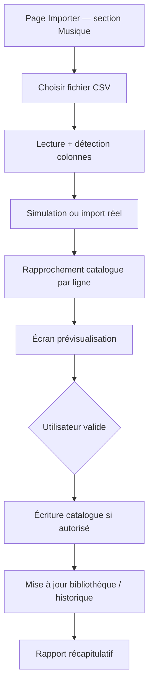

# Import bibliothèque musique — vinyles et CD (spécification — à implémenter)

**Statut :** 📋 **Notice / cahier des charges** — fonctionnalité **non développée**  
**Phase :** **M8** — après **M3 Livres** (voir [ROADMAP.md](../ROADMAP.md))  
**Version cible (indicatif) :** 0.8.x+  
**Date de rédaction :** 2026-07-04

**Onglet placeholder :** `/musique.php` (couleur ambre) — déjà en place depuis **0.7.8**.

---

## Objectif

Permettre d’**importer une bibliothèque physique** de disques (**vinyles** et **CD**) dans Médiathèque, à partir d’un fichier **CSV** (ou d’un export d’un autre outil), sans dépendre d’une API externe en v1.

Principes retenus :

- **Supports physiques uniquement** : vinyle (33 tours, 45 tours, maxi…), CD, éventuellement cassette en extension ;
- **Pas de streaming** ni de fichiers numériques (MP3, FLAC) ;
- le **catalogue partagé** (`oeuvres` + `oeuvre_musique`) peut être alimenté à l’import **ou** via saisie manuelle préalable — comportement à aligner sur BD/livres ;
- l’utilisateur **valide** les lignes ambiguës avant écriture en base ;
- réutilisation des mécanismes existants : `media_domain = musique`, foyers, envies, ressentis, prêts physiques.

---

## Périmètre

### Inclus (v1 import CSV)

| Élément | Détail |
|---------|--------|
| Import **bibliothèque personnelle** | Ajout ou mise à jour dans `bibliotheque` (collection du foyer) |
| Import **catalogue** (option admin) | Création de fiches `oeuvres` + `oeuvre_musique` si absentes |
| Formats fichier | **CSV** (séparateur `;` comme Monciné) ; ODS en extension possible |
| Métadonnées album | Artiste, titre album, année, label, genre, EAN / code-barres |
| Support exemplaire | `vinyle`, `cd`, variantes (33T, 45T, digipack…) |
| Ressenti / historique | Colonnes optionnelles « écouté le », ressenti (1–5) |
| Simulation | Mode « essai à blanc » sans écriture (comme import magazines ABM) |
| Rapport final | X ajoutés, Y mis à jour, Z ignorés, liste d’erreurs par ligne |

### Exclus (v1)

| Élément | Raison |
|---------|--------|
| Fichiers audio (MP3, FLAC, WAV) | Hors périmètre Médiathèque |
| Streaming (Spotify, Deezer, Qobuz…) | Hors périmètre |
| API **Discogs** / **MusicBrainz** | v2 — enrichissement automatique après import manuel stable |
| Import depuis compte Apple Music / Spotify | Non applicable (pas de « possession » physique) |
| Gestion des **morceaux** (pistes) | v1 = **album** entier ; pistes = évolution ultérieure |
| Multi-exemplaires identiques | v1 = un exemplaire par ligne ; doublons signalés, pas fusionnés auto |

---

## Modèle de données prévu (M8)

Aligné sur les autres domaines (tables filles, pas de gros JSON).

### Tables principales

| Table | Rôle |
|-------|------|
| `oeuvres` | `media_domain = 'musique'`, `titre` = titre de l’album |
| `oeuvre_musique` | Métadonnées spécifiques (voir ci-dessous) |
| `bibliotheque` | Lien utilisateur / foyer, `support_physique`, statut collection/envies |
| `historique` | Dates « Écouté le », ressenti |

### Champs `oeuvre_musique` (proposition)

| Colonne | Type | Description |
|---------|------|-------------|
| `artiste` | TEXT | Artiste principal ou « Artiste, Collaborateur » |
| `artiste_tri` | TEXT | Clé de tri (nom de famille pour personnes) |
| `album_titre` | TEXT | Redondant avec `oeuvres.titre` ou dérivé |
| `annee` | INTEGER | Année de sortie / pressage |
| `label` | TEXT | Maison de disques |
| `genre` | TEXT | Rock, jazz, classique… (libre ou liste connue) |
| `format_album` | TEXT | LP, EP, single, compilation… |
| `discogs_release_id` | INTEGER NULL | Réservé enrichissement v2 |
| `musicbrainz_release_id` | TEXT NULL | Réservé enrichissement v2 |

### Supports physiques (`bibliotheque.support_physique`)

Valeurs proposées (classe `MusicPhysicalSupport` à créer) :

| Code | Libellé affiché |
|------|-----------------|
| `vinyle_33` | Vinyle 33 tours |
| `vinyle_45` | Vinyle 45 tours / maxi |
| `cd` | CD |
| `cd_digipack` | CD digipack |
| `cassette` | Cassette (optionnel v1) |

### Organisation catalogue (à trancher en implémentation)

Deux options possibles — **recommandation : option A** (comme les films, un album = une œuvre).

| Option | Description | Avantage |
|--------|-------------|----------|
| **A — Album plat** | Un album = une fiche `oeuvres` | Simple, proche livres ; import CSV ligne = album |
| **B — Artiste + albums** | Table `series` pour l’artiste, albums comme « numéros » | Cohérent BD/magazines ; plus lourd à l’import |

**Décision provisoire : option A** pour la v1 import. L’artiste reste un champ `oeuvre_musique.artiste` ; regroupement « discographie » en liste filtrée par artiste.

---

## Format CSV

### Séparateur et encodage

- Séparateur : **`;`** (`MONCINE_CSV_DELIMITER`), comme l’export films Monciné.
- Encodage : **UTF-8** (BOM accepté).
- Première ligne : **en-têtes** (alias français ou anglais, normalisation comme `ImportFilmRows::normalizeHeader`).

### Colonnes bibliothèque (import utilisateur)

| Colonne CSV | Alias acceptés | Obligatoire | Exemple |
|-------------|----------------|-------------|---------|
| `ID catalogue` | `oeuvre_id`, `id` | Non* | `1204` |
| `Artiste` | `artist`, `interprete` | Oui** | `Daft Punk` |
| `Album` | `titre`, `title`, `album` | Oui** | `Random Access Memories` |
| `Année` | `year`, `annee` | Non | `2013` |
| `Label` | `maison_disques`, `editeur` | Non | `Columbia` |
| `Genre` | `style`, `styles` | Non | `Électro` |
| `Support` | `support_physique`, `format` | Non (défaut `vinyle_33`) | `cd` |
| `EAN` | `ean`, `barcode`, `code_barres` | Non | `886443576618` |
| `Possédé` | `possede`, `collection` | Non (défaut oui) | `oui` |
| `Envie` | `wishlist`, `souhait` | Non | `non` |
| `Écouté le` | `ecoute_le`, `last_played` | Non | `2026-03-15` |
| `Ressenti` | `note`, `ressenti` | Non | `J'adore` ou `5` |
| `Commentaire` | `notes`, `remarque` | Non | `Pressage FR` |

\* Si `ID catalogue` absent : rapprochement par **artiste + album + année** (voir § Matching).  
\** Au moins **Artiste + Album**, ou **ID catalogue** seul.

### Colonnes catalogue (import admin uniquement)

Mêmes colonnes + :

| Colonne | Usage |
|---------|--------|
| `ID catalogue` | Conserver l’identifiant à l’import seed (comme films) |
| `Jaquette URL` | Téléchargement local via `PosterStorage` |
| `Synopsis` | Notes album / linéaire (optionnel) |

### Exemple de fichier minimal

```csv
Artiste;Album;Année;Support;EAN;Ressenti
Daft Punk;Random Access Memories;2013;cd;886443576618;J'adore
Pink Floyd;The Dark Side of the Moon;1973;vinyle_33;;
Nirvana;Nevermind;1991;cd;0077776244425;4
```

### Compatibilité exports tiers (objectif)

Documenter des **mappings** pour conversions courantes (sans les coder en v1) :

| Source | Remarque |
|--------|----------|
| Export Excel / LibreOffice maison | Modèle CSV ci-dessus |
| Discogs collection export | Colonnes `Artist`, `Title`, `Format`, `Released` — script de conversion séparé |
| MusicBrainz | Identifiants en colonnes optionnelles pour v2 |

---

## Flux utilisateur



### Étapes détaillées

1. **Importer** (`/import.php`) — nouvelle section « Importer ma musique » (onglet **Musique** actif).
2. **Upload** — fichier CSV ; vérification taille (`MONCINE_CSV_MAX_BYTES`).
3. **Analyse** — détection en-têtes, comptage lignes, erreurs de format.
4. **Matching** — pour chaque ligne sans `ID catalogue` :
   - recherche `MusicRepository::searchCatalog(artiste, album, année)` ;
   - niveaux **auto** / **à confirmer** / **absent** (voir § Matching).
5. **Prévisualisation** — tableau : artiste, album, support, action prévue (créer / mettre à jour / ignorer).
6. **Options** :
   - **Simulation** (aucune écriture) ;
   - **Créer les fiches catalogue manquantes** (admin ou utilisateur autorisé — à définir) ;
   - **Ignorer les doublons** (même artiste + album + support déjà en bibliothèque).
7. **Application** — transaction par lot ; rapport final.

---

## Rapprochement catalogue (matching)

### Règles de confiance (proposition)

| Niveau | Condition | UI |
|--------|-----------|-----|
| **Fort** | `ID catalogue` valide **ou** 1 seul candidat artiste+album+année | Pré-coché |
| **Moyen** | Plusieurs albums du même titre (homonymes, compilations) | Décoché ; choix dans une liste |
| **Faible** | Aucun candidat | Ligne « à créer » si option activée, sinon ignorée |

### Normalisation texte

Réutiliser les patterns existants :

- `SearchMatch` ou équivalent musique (à créer : `MusicTitle`, `MusicSearchMatch`) ;
- ignorer casse, accents, ponctuation (« L'Impératrice » vs `Limperatrice`) ;
- artistes multiples : séparer sur `,`, `&`, `feat.` pour la recherche, conserver la chaîne brute en base.

### Cas particuliers

| Cas | Traitement |
|-----|------------|
| **Rééditions** même album, années différentes | Distinction par **année** + EAN si présent |
| **Singles vs albums** | Champ `format_album` ou support 45T |
| **Bandes originales** | Artiste = compositeur ou « BO Film X » — pas de lien auto vers films en v1 |
| **Boîtes multi-disques** | v1 = une ligne par disque physique ; champ `commentaire` pour lier |
| **Albums sans année** | Matching artiste+titre seul ; afficher avertissement |

---

## Comportement bibliothèque

### Album absent du catalogue, option « créer » activée

1. Insérer `oeuvres` (`media_domain = musique`, `titre` = album).
2. Insérer `oeuvre_musique` (artiste, année, label…).
3. Appeler `MusicRepository::addFromCatalogOeuvre()` ou équivalent (à créer sur le modèle `BdRepository` / `GameRepository`).

### Album déjà au catalogue, pas dans Ma musique

- `addFromCatalogOeuvre` avec `support_physique`, EAN sur `bibliotheque` si prévu.

### Album déjà en collection (même œuvre + même support)

- **Ignorer** ou **mettre à jour** champs non vides (ressenti, date écouté) — case à cocher « Écraser les fiches existantes ».

### Historique et ressenti

- Colonne « Écouté le » → `historique` (comme « Vu le » films / « Lu le » BD).
- Colonne « Ressenti » → `RessentiNote::fromImportValue()` (déjà utilisé pour films en 0.7.6).

---

## Intégration Médiathèque (fichiers prévus)

| Zone | Fichiers / classes (indicatif) |
|------|--------------------------------|
| Schéma SQL | `sql/migrations/0xx_oeuvre_musique.sql` |
| Domaine | `MediaDomain::MUSIQUE` (✅ placeholder 0.7.8) |
| Repository | `MusicRepository`, `MusicRowMapper`, `MusicListFilter` |
| Import | `MusicImportCsv`, `MusicImportRows`, `MusicImportRunner` |
| Schéma colonnes | `MusicExportSchema`, `MusicLibraryExportSchema` |
| UI | Section dans `templates/import.php` ; `_music_import_panel.php` |
| Handler | `www/importer-musique.php` (POST validation + CSRF) |
| CLI (optionnel) | `lib/cli/music-import-catalog.php` pour seeds |
| Tests | `MusicImportCsvTest`, `MusicRepositoryTest`, `MusicSearchMatchTest` |

### Réutilisation existante

| Besoin | Existant |
|--------|----------|
| Lecture CSV | `ImportCsv`, `ImportFilmRows::mapHeaders`, `ImportFormat` |
| Ressenti import | `RessentiNote` |
| Prêts physiques | `LoanEligibility`, `LoanRepository` (règles M6) |
| Jaquettes | `PosterStorage::ensureLocalForOeuvre()` |
| Page d’entrée | `/import.php` |
| EAN | Colonne `bibliotheque.ean` ou `oeuvres` selon convention retenue |

---

## Sécurité et droits

- **CSRF** sur tout POST (`Csrf::rejectUnlessValid`).
- Import bibliothèque : utilisateur connecté, foyer courant uniquement.
- Création **catalogue** à l’import : réservée **admin** (comme soumissions catalogue jeux/films) — à confirmer en implémentation.
- Ne pas exécuter de code ni d’URL arbitraire depuis le CSV ; `Jaquette URL` = HTTPS uniquement, téléchargement contrôlé.
- Limite taille fichier : `MONCINE_CSV_MAX_BYTES`.

---

## Évolutions ultérieures (hors v1)

| Évolution | Description |
|-----------|-------------|
| **Discogs** | OAuth ou token ; recherche release par EAN ; jaquette + métadonnées |
| **MusicBrainz** | Identifiant release MBID ; pas de clé obligatoire (API publique) |
| **Export CSV** | Symétrique de l’import — priorité M6 transversal |
| **Discographie** | Vue « tous les albums d’un artiste » (filtre ou pseudo-série) |
| **Pistes** | Table `oeuvre_musique_piste` (numéro, titre, durée) |
| **Lien films** | BO film ↔ fiche film (comme pont magazine ↔ jeu) |

Références API (pour v2) :

- [Discogs API](https://www.discogs.com/developers)
- [MusicBrainz API](https://musicbrainz.org/doc/MusicBrainz_API)

---

## Critères d’acceptation (tests manuels)

1. CSV minimal (artiste + album + support) → album ajouté en **Ma musique**.
2. Ligne avec `ID catalogue` valide → mise à jour sans doublon.
3. Même album en vinyle et en CD → **deux exemplaires** distincts si l’utilisateur le souhaite (deux lignes ou deux supports).
4. Colonne ressenti « J'adore » → icône correcte sur la fiche.
5. Colonne « Écouté le » → entrée dans l’historique.
6. Simulation → aucune écriture, rapport identique au réel.
7. Ligne sans artiste ni album → erreur lisible « Ligne N ».
8. Import admin avec création catalogue → fiche visible dans le catalogue partagé `media_domain = musique`.
9. Onglet Musique placeholder → après implémentation, `/musique.php` affiche la collection au lieu de « bientôt ».

---

## Liens

- [ROADMAP.md](../ROADMAP.md) § M8 — Musique (vinyles, CD)
- [doc/conventions-techniques.md](conventions-techniques.md) — `media_domain`, nommage
- [doc/import-gog.md](import-gog.md) — modèle de notice import (jeux)
- [CHANGELOG.md](../CHANGELOG.md) — versions livrées

*Dernière mise à jour : 2026-07-04 — notice initiale, implémentation à planifier après M3 Livres.*
